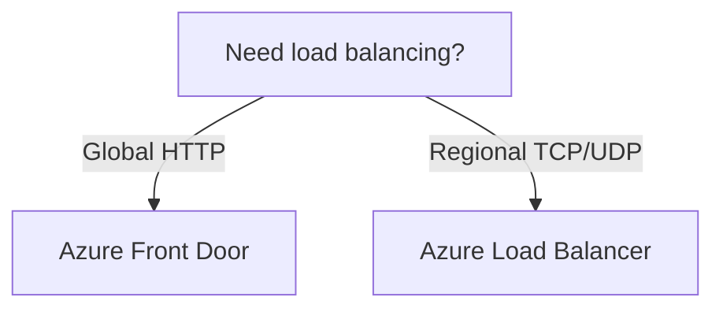

# GitHub Copilot Instructions — azure-cheat-sheets

## Project Overview

Quick-reference study notes for Azure architecture decisions. Aimed primarily at
candidates preparing for AZ-305: Designing Microsoft Azure Infrastructure Solutions.
The focus is service selection, architectural trade-offs, and decision reasoning —
not step-by-step walkthroughs, portal screenshots, or hands-on labs.

All primary content lives in the Markdown files under `docs/`. A Makefile with
Python and Node dev tooling handles validation and CI (markdownlint, Mermaid
validation, ruff lint + format check, pytest with coverage, MkDocs strict build).

Live site: https://azure-cheat-sheets.vercel.app

## Repository Structure

```
docs/
  azure/
    cheat_sheets/
      AZ-305.md             — AZ-305 architect cheat sheet
      AZ-104.md             — AZ-104 administrator cheat sheet
    diagrams/<section>/     — standalone Mermaid sources (.mmd), one per file
      <slug>.mmd            — exam-agnostic slug
    files/<section>/        — shared section snippet files
      <section>.md          — e.g. networking/networking.md
  index.md                  — MkDocs home page
scripts/
  validate_mermaid.py       — Mermaid diagram validation helper
tests/
  conftest.py
  test_validate_mermaid.py
  test_issue_*.py           — regression tests per issue
mkdocs.yml                  — MkDocs Material configuration
pyproject.toml              — Python deps, ruff, pytest, coverage config
Makefile                    — all local CI targets
openspec/archive/           — closed spec/impl records (read-only reference)
```

Section directories under `docs/azure/diagrams/` and `docs/azure/files/`:
`networking`, `security`, `storage`, `monitoring`, `compute`, `identity`,
`ha-dr`, `governance`, `messaging`, `waf`

The cheat sheets are organized into ten top-level sections:

1. Networking
2. Security
3. Storage
4. Monitoring & Observability
5. Compute
6. Identity & Access
7. High Availability & Disaster Recovery
8. Governance
9. Messaging & Integration
10. Well-Architected Framework

## Exam Overlap

| Exam   | Focus             | Relevant Sections |
|--------|-------------------|-------------------|
| AZ-900 | Fundamentals      | Networking (overview), Storage, Compute, Identity & Access (Entra basics) |
| AZ-104 | Administrator     | All sections — administrator-level depth on RBAC, Networking, HA & DR; Messaging & Integration (partial) |
| AZ-305 | Architect         | All sections including Messaging & Integration and Well-Architected Framework |
| AZ-500 | Security Engineer | Security (full), Identity & Access (full), Networking (partial), Monitoring & Observability (partial), Governance (partial) |
| AZ-700 | Network Engineer  | Networking (full), High Availability & Disaster Recovery (partial) |

## Setup

```bash
# One-time after cloning — creates .venv, installs Python + Node deps
make install
```

## Local CI

Run the full pipeline before opening a PR:

```bash
make ci
```

| Target              | What it does                                           |
|---------------------|--------------------------------------------------------|
| `make markdownlint` | markdownlint-cli2 over docs/, README.md, AGENTS.md     |
| `make mermaid-check`| Validates all .md and .mmd Mermaid diagrams via mmdc   |
| `make python-lint`  | ruff check + ruff format --check on scripts/ and tests/|
| `make python-audit` | pip-audit CVE scan                                     |
| `make python-test`  | pytest with 90% coverage requirement                   |
| `make docs-build`   | MkDocs strict build into site/                         |

Serve docs locally with hot-reload:

```bash
make docs-serve   # http://127.0.0.1:8000
```

## Content Guidelines

When adding or editing content, follow these rules precisely:

- Keep explanations concise and comparison-oriented.
- Section headings: top-level domain names in ALL CAPS (`# NETWORKING`).
  Sub-topics as `##`. Do not use Title Case for top-level section headings.
- Prefer tables when comparing Azure services, tiers, or design options.
  Use these column templates:

  Networking / compute services:
  | Service | Layer | Scope | Use Case | Key Feature |

  Data / storage services:
  | Service | Type | Best For | Key Feature |

  Consistency columns (always present): Service, Key Feature.
  Do not add free-form columns not in the template above. If a different
  comparison type is needed, prefer a Mermaid diagram.

- Use short exam-tip callouts only when they clarify a likely decision point.
  Place the callout immediately after the relevant table, using this format:

  > **Exam tip:** Choose Azure Front Door when the requirement mentions
  > global HTTP load balancing, WAF, or SSL offload at the edge.

  Do not use plain blockquotes, bold sentences, or note/warning admonitions
  for exam tips.

- For retired, retiring, or superseded services, use a deprecation callout
  instead of an exam-tip. See the
  [Deprecation warnings](CONTRIBUTING.md#10-deprecation-warnings) section in
  CONTRIBUTING.md for the required format.

- Do not document features or claims not already reflected in the repository
  content.

## Mermaid Diagrams

Each diagram lives in its own `docs/azure/diagrams/<section>/<slug>.mmd` file.
Reference it from a cheat sheet via a PyMdown Snippets directive:

```text
```mermaid
--8<-- "azure/diagrams/<section>/<slug>.mmd"
```
```

The `.mmd` file is the single source of truth — the same file may be referenced
from multiple cheat sheets. Run `make mermaid-check` after adding or editing any
`.mmd` file.

Choose the directive by purpose:

| Purpose                        | Directive    |
|--------------------------------|--------------|
| Decision flows (if/else trees) | flowchart TD |
| Hierarchy / ecosystem maps     | graph TD     |
| Connectivity / network paths   | graph LR     |

Example:



GitHub renders Mermaid natively. For local preview, install the
"Markdown Preview Mermaid Support" extension in VS Code.

## Pull Request Checklist

- Branch from `main` using the correct prefix:
  - `feature/<issue-id>-<topic>` — new content
  - `fix/<issue-id>-<topic>` — corrections
  - `chore/<topic>` — tooling / CI / deps
  - `docs/<topic>` — meta-documentation
- Run `make ci` locally — it must pass clean.
- Verify Mermaid diagrams and Markdown render correctly via `make docs-serve`.
- Scope changes to one improvement area per PR.
- Explain in the PR description which section changed and why it improves the
  cheat sheet for readers.

## License

GPL-3.0 — see LICENSE.
