# Designing Microsoft Azure Infrastructure Solutions

## Comprehensive Cheat Sheet

> **Exam Focus:** Architectural decision-making — *which* service, *why*, *when*. Not how to configure.

---

## Table of Contents

1. [Networking](#networking)
2. [Security](#security)
3. [Storage](#storage)
4. [Monitoring & Observability](#monitoring--observability)
5. [Compute](#compute)
6. [Identity & Access](#identity--access)
7. [High Availability & Disaster Recovery](#high-availability--disaster-recovery)
8. [Governance](#governance)
9. [Messaging & Integration](#messaging--integration)
10. [Well-Architected Framework](#well-architected-framework)

---

## Exam Track Index

| Section | AZ-900 | AZ-104 | AZ-305 | AZ-500 | AZ-700 |
| --- | --- | --- | --- | --- | --- |
| [Networking](#networking) | Partial | Full | Full | Partial | Full |
| [Security](#security) | — | Partial | Full | Full | — |
| [Storage](#storage) | Partial | Full | Full | — | — |
| [Monitoring & Observability](#monitoring--observability) | — | Partial | Full | Partial | — |
| [Compute](#compute) | Partial | Full | Full | — | — |
| [Identity & Access](#identity--access) | Partial | Full | Full | Full | — |
| [High Availability & Disaster Recovery](#high-availability--disaster-recovery) | — | Full | Full | — | Partial |
| [Governance](#governance) | — | Partial | Full | Partial | — |
| [Messaging & Integration](#messaging--integration) | — | — | Full | — | — |
| [Well-Architected Framework](#well-architected-framework) | — | — | Full | — | — |

> **Exam tip:** AZ-900 rows marked Partial cover conceptual awareness only.
> AZ-104 Full rows require administrator-level depth. AZ-305 covers all
> sections with an architectural decision-making focus. AZ-500 Full/Partial
> rows indicate security-engineer depth. AZ-700 Full/Partial rows indicate
> network-engineer depth.

---

## AZ-500 Quick Index

Key sub-topics for AZ-500 Security Engineer candidates:

- [Microsoft Defender for Cloud](#microsoft-defender-for-cloud)
- [Azure Key Vault & Access Models](#azure-key-vault)
- [Encryption](#encryption)
- [Policy & Compliance](#policy--compliance)
- [Authentication & Password Security — PIM, Conditional Access, Identity Protection](#authentication--password-security)
- [Microsoft Sentinel](#microsoft-sentinel)
- [Network Security — NSGs, Azure Firewall, DDoS](#network-security)
- [RBAC](#rbac)
- [PIM Key Concepts](#pim-key-concepts)
- [Log Analytics & Diagnostic Settings](#diagnostic-settings)
- [Governance — Management Hierarchy, Locks](#management-hierarchy)

---

# NETWORKING

> Also relevant for: **AZ-900** (foundational networking concepts) and **AZ-104**
> (VNet design, NSGs, load balancing administration).

## Load Balancers

| Service | Layer | Scope | Use Case | Key Feature |
| --- | --- | --- | --- | --- |
| **Azure Load Balancer** | L4 (TCP/UDP) | Regional | Internal or public VM load balancing | Low latency, non-HTTP |
| **Application Gateway** | L7 (HTTP/S) | Regional | Web apps, URL-based routing | WAF, SSL termination, cookie affinity |
| **Azure Front Door** | L7 (HTTP/S) | Global | Multi-region web apps, CDN+WAF | Anycast, global routing, WAF, CDN |
| **Traffic Manager** | DNS-based | Global | Non-HTTP global routing, failover | DNS TTL-based, not a proxy |
| **API Management** | L7 (HTTP/S) | Regional/Global | API gateway, rate limiting, auth | Policies, developer portal, caching |

### Decision Flow

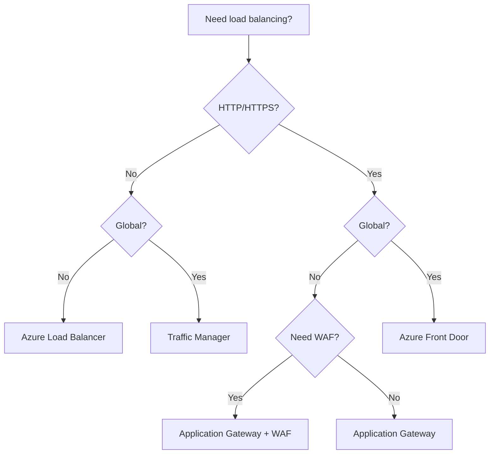
```mermaid
flowchart TD
    A[Need load balancing?] --> B{HTTP/HTTPS?}
    B -- No --> C{Global?}
    B -- Yes --> D{Global?}
    C -- No --> E[Azure Load Balancer]
    C -- Yes --> F[Traffic Manager]
    D -- No --> G{Need WAF?}
    D -- Yes --> H[Azure Front Door]
    G -- Yes --> I[Application Gateway + WAF]
    G -- No --> J[Application Gateway]
```

---

## API Management (APIM)

### Tier Comparison

| Tier | VNet Injection | Scale Units | Availability Zones | Primary Use Case |
| --- | --- | --- | --- | --- |
| Consumption | None | Serverless (auto) | No | Lightweight, event-driven APIs; no portal; cold-start |
| Developer | External / Internal | 1 (no scale-out) | No | Non-production, dev/test, full feature exploration |
| Basic | None | Up to 2 | No | Entry-level production; no VNet, limited SLA |
| Standard | External / Internal | Up to 4 | No | Production; VNet injection without AZ or multi-region |
| Premium | External / Internal | Up to 31 per region | Yes (multi-region) | Enterprise; multi-region gateways, AZs, private APIs |

> **v2 note:** Basic v2 and Standard v2 are GA. They offer faster provisioning and VNet integration via injection (Standard v2) but do not yet support all Premium features (multi-region, self-hosted gateway at scale). Use Premium v1/v2 for full enterprise requirements.

### Policy Evaluation Order

| Layer | Trigger | Typical Use |
| --- | --- | --- |
| Inbound | Every request on arrival at gateway | JWT validation, rate limiting, IP filtering, rewriting |
| Backend | Just before forwarding to backend | Load-balance, set backend URL, retry policy |
| Outbound | After backend response, before reply | Response transformation, header stripping, caching |
| On-Error | Any unhandled exception in the chain | Uniform error responses, logging, alerting |

### Decision Flow — API Gateway Selection

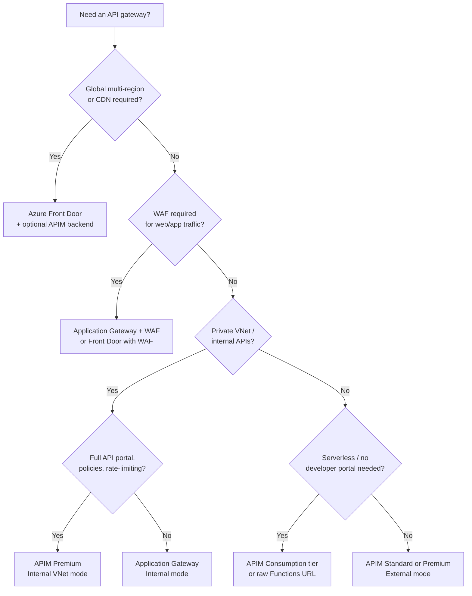
```mermaid
flowchart TD
    A[Need an API gateway?] --> B{Global multi-region\nor CDN required?}
    B -- Yes --> C[Azure Front Door\n+ optional APIM backend]
    B -- No --> D{WAF required\nfor web/app traffic?}
    D -- Yes --> E[Application Gateway + WAF\nor Front Door with WAF]
    D -- No --> F{Private VNet /\ninternal APIs?}
    F -- Yes --> G{Full API portal,\npolicies, rate-limiting?}
    G -- Yes --> H[APIM Premium\nInternal VNet mode]
    G -- No --> I[Application Gateway\nInternal mode]
    F -- No --> J{Serverless / no\ndeveloper portal needed?}
    J -- Yes --> K[APIM Consumption tier\nor raw Functions URL]
    J -- No --> L[APIM Standard or Premium\nExternal mode]
```

> **Exam Tips**
>
> - Consumption tier is serverless — there is no VNet injection and there is a cold-start on the first call after idle. Choose it only when portal and VNet are not required.
> - Premium is the only tier that supports multi-region gateway deployment and availability zones. Any exam scenario requiring geo-redundant API exposure points to Premium.
> - Policy evaluation order matters: Inbound is the correct layer to validate JWTs and enforce auth before the request reaches the backend. Placing auth in Outbound is a common distractor.

---

## Virtual Networks (VNet)

| Service | Layer | Scope | Use Case | Key Feature |
| --- | --- | --- | --- | --- |
| **VNet Peering** | L3 | Regional / Global | Same or cross-region VNet connectivity without a gateway | Low latency; no gateway required; non-transitive by default |
| **VNet-to-VNet VPN** | L3 | Global | Cross-region or cross-subscription encrypted connectivity | IPSec/IKE tunnel; older pattern superseded by peering in most cases |
| **ExpressRoute** | L3 | Global | Private dedicated circuit for enterprise workloads | SLA-backed; avoids public internet; supports up to 100 Gbps |
| **VPN Gateway** | L3 | Regional | On-premises to Azure encrypted tunnel | Site-to-site, point-to-site, and VNet-to-VNet; cost-effective |
| **Azure Bastion** | L7 | Regional | Secure browser-based RDP/SSH without public VM IPs | Deployed per VNet; no jump-box VM required |
| **Private Endpoint** | L3 | Regional | Private IP access to PaaS services inside a VNet | NIC injected into VNet; DNS integration required |
| **Service Endpoint** | L3 | Regional | Route PaaS traffic over Azure backbone from a subnet | No private IP; PaaS firewall can restrict to specific subnets |

> **⚠️ Deprecation warning:** VNet-to-VNet VPN is superseded by VNet Peering for most
> cross-region and cross-subscription connectivity scenarios. Prefer peering (lower latency,
> no gateway required). Retain VNet-to-VNet VPN only when IPSec encryption across the Azure
> backbone is an explicit requirement.

> **Private Endpoint vs Service Endpoint:**
>
> - Private Endpoint = PaaS resource gets a NIC in your VNet (true private)
> - Service Endpoint = traffic stays on Azure backbone but PaaS still has public IP

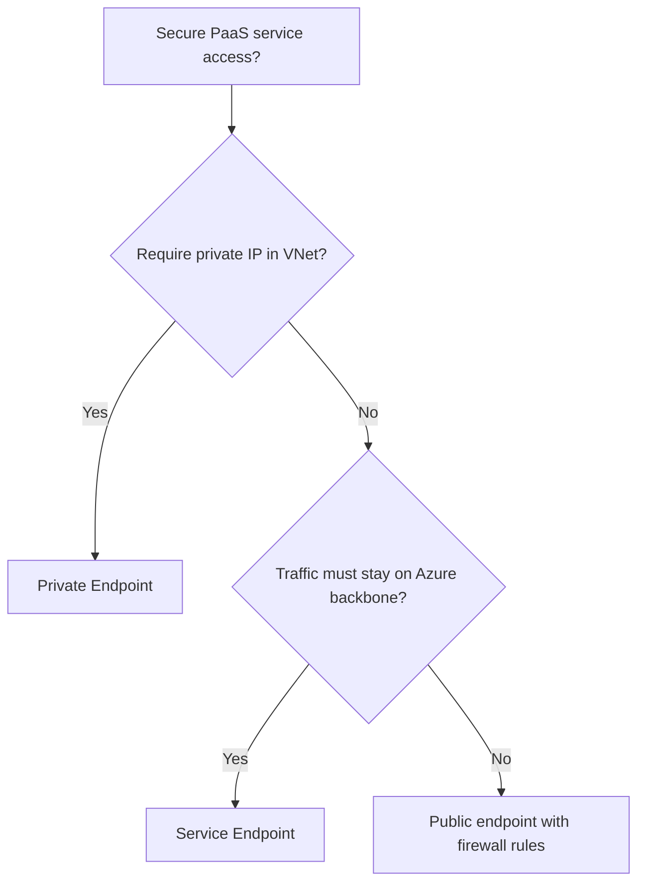
```mermaid
flowchart TD
    A[Secure PaaS service access?] --> B{Require private IP in VNet?}
    B -- Yes --> PE[Private Endpoint]
    B -- No --> C{Traffic must stay on Azure backbone?}
    C -- Yes --> SE[Service Endpoint]
    C -- No --> PUB[Public endpoint with firewall rules]
```

---

## DNS

| Service | Layer | Scope | Use Case | Key Feature |
| --- | --- | --- | --- | --- |
| **Azure DNS** | DNS | Global | Host public DNS zones in Azure | Authoritative DNS; delegates to Azure name servers |
| **Azure Private DNS Zones** | DNS | Regional (VNet-linked) | Name resolution within VNets | Auto-registration of VM records; linked to one or more VNets |
| **Private DNS Resolver** | DNS | Regional | Hybrid DNS — forward on-prem queries to Azure Private DNS | Inbound/outbound endpoints; replaces custom DNS VM |

---

## Network Security

### NSG and ASG

| Service | Layer | Scope | Use Case | Key Feature |
| --- | --- | --- | --- | --- |
| **NSG** | L3/L4 | Subnet or NIC | Allow/deny inbound and outbound traffic by port, protocol, and IP range | Stateful; 5-tuple rules; default-deny inbound from Internet |
| **ASG** | L3/L4 | NIC (group tag) | Simplify NSG rules for multi-tier apps by grouping NICs logically | Referenced as source/destination in NSG rules; no IP management |

> **Exam tip:** Use ASGs when NSG rules would otherwise require explicit IP lists for
> multi-tier workloads. ASGs do not replace NSGs — they are used as dynamic address
> groups inside NSG rules.

### DDoS Protection Tiers

| Service | Layer | Scope | Use Case | Key Feature |
| --- | --- | --- | --- | --- |
| **DDoS Network Protection** | L3/L4 | VNet | Enterprise workloads requiring SLA guarantee and telemetry | Per-VNet billing; adaptive tuning; cost protection SLA |
| **DDoS IP Protection** | L3/L4 | Public IP | Single-resource protection without VNet-wide commitment | Pay-per-protected-IP; lighter entry point |
| **DDoS Infrastructure Protection** | L3/L4 | Platform (all Azure) | Baseline free protection for every Azure customer | Always-on; no configuration; limited telemetry |

> **Exam tip:** Choose DDoS Network Protection when the requirement mentions volumetric
> attack mitigation with SLA guarantees, custom thresholds, or attack analytics.
> Infrastructure Protection is free but provides no per-customer telemetry or SLA.

### Azure Firewall SKUs

| Service | Layer | Scope | Use Case | Key Feature |
| --- | --- | --- | --- | --- |
| **Azure Firewall Basic** | L3–L7 | Regional (hub VNet) | SMB workloads, dev/test, cost-sensitive scenarios | Fixed 250 Mbps throughput; no threat intel feed; no IDPS |
| **Azure Firewall Standard** | L3–L7 | Regional (hub VNet) | Production hub-and-spoke; FQDN filtering | Threat intelligence feed; application/network rules; SNAT |
| **Azure Firewall Premium** | L3–L7 | Regional (hub VNet) | Regulated or high-security environments | TLS inspection; IDPS; URL filtering; web categories |

> **Exam tip:** Choose Azure Firewall Premium when the requirement mentions TLS
> inspection, intrusion detection/prevention (IDPS), or URL-category filtering.
> Standard covers most production scenarios; Basic is not suitable for production
> workloads requiring threat intelligence.

### Decision Flow — Network Security Selection

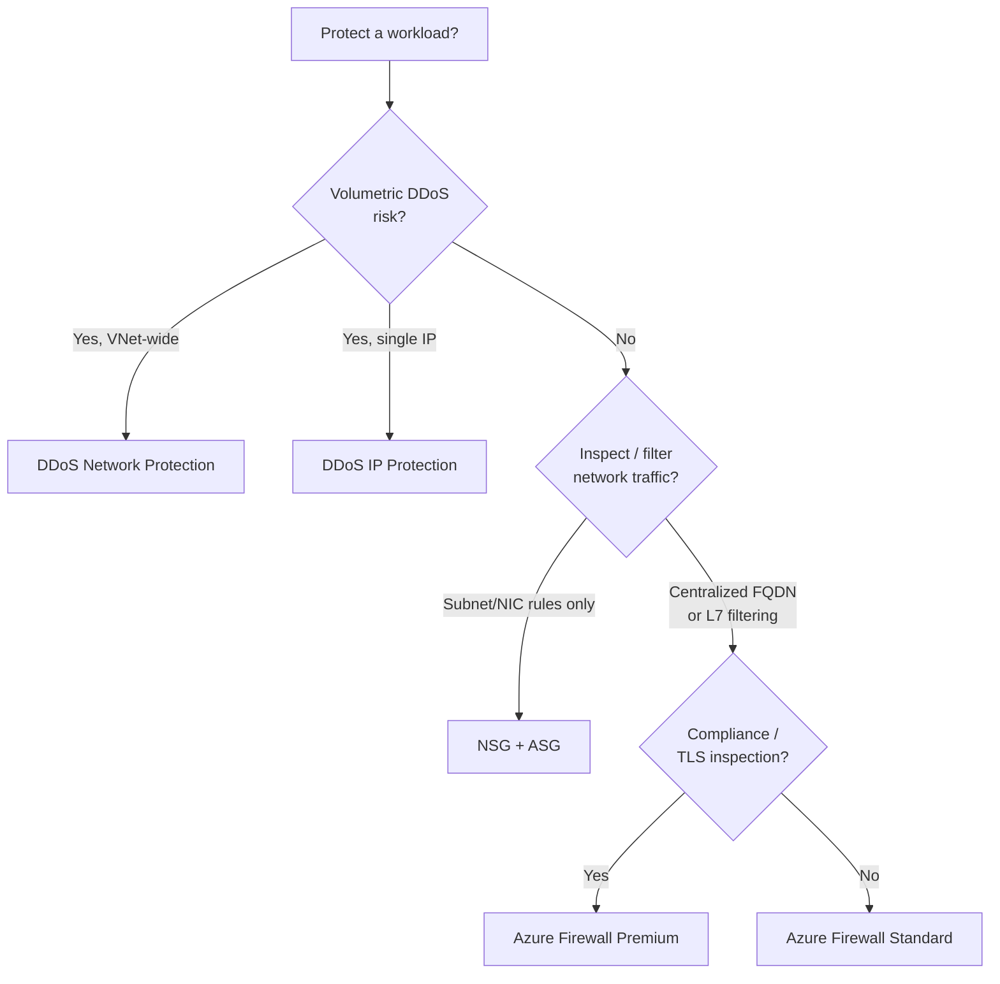
```mermaid
flowchart TD
    A[Protect a workload?] --> B{Volumetric DDoS\nrisk?}
    B -- Yes, VNet-wide --> C[DDoS Network Protection]
    B -- Yes, single IP --> D[DDoS IP Protection]
    B -- No --> E{Inspect / filter\nnetwork traffic?}
    E -- Subnet/NIC rules only --> F[NSG + ASG]
    E -- Centralized FQDN\nor L7 filtering --> G{Compliance /\nTLS inspection?}
    G -- Yes --> H[Azure Firewall Premium]
    G -- No --> I[Azure Firewall Standard]
```

---

> **Exam tip (AZ-500):** For AZ-500, know the layered network security model:
> NSG = layer-4 allow/deny on subnet or NIC; Azure Firewall = stateful L3-L7
> with FQDN rules and threat intelligence; NVA = third-party deep inspection.
> DDoS Protection Standard (not Basic) is required when the question mentions
> SLA-backed mitigation, telemetry, or cost protection for volumetric attacks.

## Content Delivery (CDN)

| Service | Layer | Scope | Use Case | Key Feature |
|---|---|---|---|---|
| **Azure Front Door** | L7 (HTTP/S) | Global | CDN + WAF + global LB combined | Anycast PoP, WAF, SSL offload, caching rules |
| **Azure CDN (Microsoft)** | L7 (HTTP/S) | Global | Static asset delivery, simple CDN | Verizon/Akamai PoPs, rules engine, legacy option |

> **⚠️ Deprecation warning:** Azure CDN classic profiles (Verizon and Akamai) are retiring
> 30 September 2027. Migrate to **Azure Front Door** (CDN + WAF + global LB) or
> **Azure CDN Standard from Microsoft** for pure CDN workloads.
> See: [Microsoft retirement announcement](https://learn.microsoft.com/en-us/azure/cdn/classic-cdn-retirement-faq)

> **Exam tip:** Choose Azure Front Door when the requirement mentions global HTTP load balancing,
> WAF, or SSL offload at the edge.

---

## Connectivity Patterns

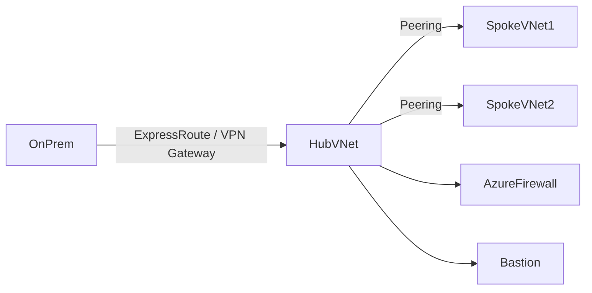
```mermaid
graph LR
    OnPrem -->|ExpressRoute / VPN Gateway| HubVNet
    HubVNet -->|Peering| SpokeVNet1
    HubVNet -->|Peering| SpokeVNet2
    HubVNet --> AzureFirewall
    HubVNet --> Bastion
```

| Pattern | Description |
| --- | --- |
| **Hub-Spoke** | Central hub VNet with shared services (firewall, bastion, DNS), spokes per workload |
| **Virtual WAN** | Microsoft-managed hub-spoke at scale, with SD-WAN integration |

---

# SECURITY

> Also relevant for: **AZ-104** (Defender for Cloud policies, Key Vault
> administration, security baselines).

## Microsoft Defender for Cloud

| Plan | Covers | Key Feature |
| --- | --- | --- |
| **Defender for Servers** | VMs, Arc servers | Vulnerability assessment, JIT VM access |
| **Defender for Storage** | Blob, Files, ADLS | Malware scanning, anomaly detection |
| **Defender for SQL** | Azure SQL, SQL Server | SQL injection detection, anomalous access |
| **Defender for Containers** | AKS, ACR, Arc K8s | Image scanning, runtime threat detection |
| **Defender for App Service** | Web apps | Threat detection, malicious domain alerts |
| **Defender for Key Vault** | Key Vault | Suspicious access pattern alerts |
| **Defender for DNS** | DNS layer | Detect C2 communication |
| **Defender CSPM** | Cloud posture | Attack path analysis, governance |

---

> **⚠️ Deprecation warning:** "Security Center" and "Azure Defender" are legacy names.
> The current product is **Microsoft Defender for Cloud**. Older exam questions may still
> use the former names.

> **Exam tip (AZ-500):** JIT VM Access (under Defender for Servers) locks down management
> ports and opens them only on approved request; choose it when the requirement mentions
> reducing the attack surface on VM management ports.

## Azure Key Vault

| Feature | Detail |
| --- | --- |
| **Secrets** | Connection strings, passwords, API keys |
| **Keys** | Encryption keys (RSA, EC) — HSM-backed option |
| **Certificates** | Manage TLS/SSL lifecycle |
| **Soft Delete** | Retain deleted objects for 7–90 days |
| **Purge Protection** | Prevent permanent deletion during retention |
| **RBAC vs Access Policies** | RBAC preferred (granular, Azure AD-native) |
| **Private Endpoint** | Restrict Key Vault to VNet-only access |

> Exam tip: Always use **Managed Identity** to access Key Vault — never store credentials in app config.

## Key Vault Access Models

| Service | Access Model | Audit | Granularity | Key Feature |
| --- | --- | --- | --- | --- |
| **Key Vault** | Vault Access Policies (legacy) | Per-vault log; no per-operation identity trail | Coarse — get/list/set apply to all secrets | Simple setup; max 1024 policies per vault |
| **Key Vault** | Azure RBAC | Full Azure Activity Log + Entra audit trail | Fine-grained — role assignment per secret/key/cert | Entra-native; supports PIM, Conditional Access |

> **⚠️ Deprecation warning:** Vault Access Policies are the legacy authorization model for
> Key Vault. Microsoft recommends migrating to **Azure RBAC** for new and existing vaults.
> RBAC provides Entra-native granularity, PIM support, and a unified audit trail.

> **Exam tip:** Choose Azure RBAC for Key Vault when the requirement mentions
> Entra integration, Privileged Identity Management (PIM), per-resource
> granularity, or migration away from legacy Access Policies.

Use **Managed Identity** bound to an Azure RBAC role (e.g. Key Vault Secrets User)
as the credential-free pattern — no secrets stored in application configuration.

---

## Encryption

| Type | Description | Service |
| --- | --- | --- |
| **Encryption at rest** | Data encrypted on disk | Default in Azure Storage, SQL, etc. |
| **CMK (Customer-Managed Keys)** | You control key in Key Vault | Stricter compliance, storage + SQL |
| **PMK (Platform-Managed Keys)** | Microsoft manages key | Default, lower admin overhead |
| **Double Encryption** | Two layers of encryption | Azure Storage, Disks |
| **Encryption in transit** | TLS enforced | All Azure services |
| **Azure Disk Encryption** | BitLocker (Windows) / dm-crypt (Linux) | VM OS and data disks |
| **SSE (Server-Side Encryption)** | Storage service encrypts before writing | Azure Blob, Files, Queues |

---

## Policy & Compliance

| Concept | Description |
| --- | --- |
| **Azure Policy** | Enforce, audit, or remediate resource configurations |
| **Policy Initiative** | Group of policies (e.g., CIS benchmark) |
| **Deny Effect** | Block non-compliant resource creation |
| **Audit Effect** | Flag non-compliance without blocking |
| **DeployIfNotExists** | Auto-remediate — deploy missing configs |
| **Modify Effect** | Auto-add tags or properties |
| **Compliance Dashboard** | See % compliance across subscriptions |
| **Regulatory Compliance** | Pre-built initiatives: NIST, ISO 27001, PCI-DSS |

> Exam tip: **DeployIfNotExists** requires a managed identity for the policy assignment to execute remediation.

---

## Authentication & Password Security

| Feature | Description | Use Case |
| --- | --- | --- |
| **MFA** | Multi-factor authentication | All users, especially admins |
| **Passwordless** | FIDO2 key, Microsoft Authenticator, Windows Hello | Zero-password auth |
| **Conditional Access** | Policy-based access decisions | Enforce MFA by location/risk/device |
| **Identity Protection** | Risk-based sign-in/user risk policies | Auto-block risky sign-ins |
| **SSPR (Self-Service Password Reset)** | Users reset their own passwords | Reduce helpdesk load |
| **Password Protection** | Block weak/known-bad passwords | On-prem AD + Azure AD |
| **PIM (Privileged Identity Management)** | Just-in-time privileged access | Admin roles activated on demand |
| **Access Reviews** | Periodic review of group/role membership | Compliance, least-privilege enforcement |

---

## Microsoft Sentinel

| Component | Purpose |
| --- | --- |
| **Data Connectors** | Ingest logs from Azure, M365, 3rd party |
| **Analytics Rules** | Detect threats from log patterns |
| **Playbooks (Logic Apps)** | Auto-respond to incidents |
| **Workbooks** | Visualize security data |
| **UEBA** | User and entity behavior analytics |
| **Threat Intelligence** | Feed-based IOC matching |

> Sentinel = SIEM + SOAR. Defender for Cloud = CSPM + workload protection. They integrate but serve different roles.

---

> **Exam tip (AZ-500):** Sentinel is a cloud-native SIEM + SOAR; Defender for
> Cloud is CSPM + workload protection. AZ-500 questions that mention "incident
> response automation" or "playbook" point to Sentinel. Questions that mention
> "secure score" or "recommendations" point to Defender for Cloud.

# STORAGE

> Also relevant for: **AZ-900** (storage account concepts, redundancy
> options) and **AZ-104** (storage account management, access keys,
> lifecycle policies, file shares).

## Storage Account Types

| Type | Supported Services | Use Case |
| --- | --- | --- |
| **Standard GPv2** | Blob, File, Queue, Table | General purpose, most scenarios |
| **Premium Block Blobs** | Block Blob only | Low-latency blob I/O, analytics |
| **Premium File Shares** | Azure Files only | High-performance SMB/NFS shares |
| **Premium Page Blobs** | Page Blob only | Unmanaged VM disks |

---

## Blob Storage Access Tiers

| Service | Type | Best For | Key Feature |
| --- | --- | --- | --- |
| **Hot** | Blob access tier | Frequently accessed data; no minimum retention | Lowest access cost; highest storage cost |
| **Cool** | Blob access tier | Infrequently accessed data; min 30-day retention | Lower storage cost; higher per-operation cost |
| **Cold** | Blob access tier | Rarely accessed data; min 90-day retention | Lower storage cost than Cool; higher access cost |
| **Archive** | Blob access tier | Long-term archival; min 180-day retention | Lowest storage cost; requires rehydration (hours) before read |

> **Exam tip:** Use Lifecycle Management policies to auto-transition blobs
> through tiers. Archive blobs must be rehydrated to Hot or Cool before access;
> plan for rehydration latency in recovery scenarios.

---

## Storage Redundancy

| Service | Type | Best For | Key Feature |
| --- | --- | --- | --- |
| **LRS** | Storage redundancy | Dev/test; lowest cost; no zone/regional DR requirement | 3 copies in one datacenter; 99.9999999% durability |
| **ZRS** | Storage redundancy | Regional HA; zone-failure tolerance; no cross-region DR | 3 copies across 3 AZs in one region; no data loss on zone outage |
| **GRS** | Storage redundancy | Cross-region DR; secondary readable only after failover | 6 copies (3 primary + 3 secondary region); RPO < 15 min |
| **RA-GRS** | Storage redundancy | Cross-region DR with continuous read access to secondary | GRS + secondary endpoint always readable; 99.99% read SLA |
| **GZRS** | Storage redundancy | HA + cross-region DR without secondary read requirement | 3 AZs primary + geo-replicated secondary; highest resilience |
| **RA-GZRS** | Storage redundancy | Maximum durability with continuous secondary read access | GZRS + secondary endpoint always readable; 99.99% read SLA |

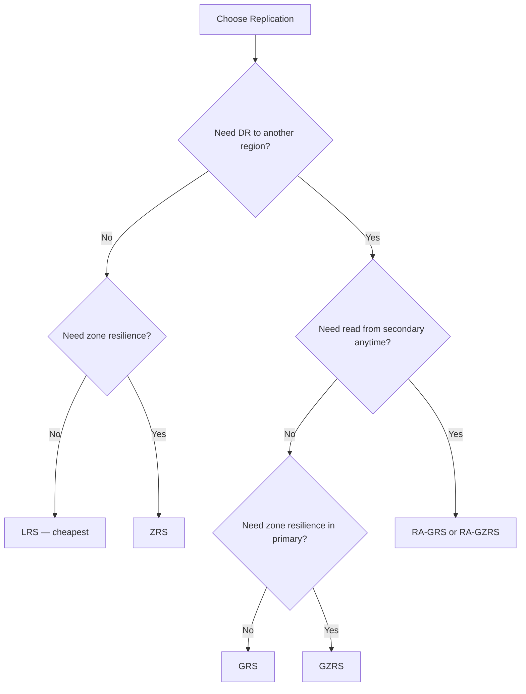
```mermaid
graph TD
    A[Choose Replication] --> B{Need DR to another region?}
    B -- No --> C{Need zone resilience?}
    B -- Yes --> D{Need read from secondary anytime?}
    C -- No --> E[LRS — cheapest]
    C -- Yes --> F[ZRS]
    D -- No --> G{Need zone resilience in primary?}
    D -- Yes --> H[RA-GRS or RA-GZRS]
    G -- No --> I[GRS]
    G -- Yes --> J[GZRS]
```

> **Exam tip:** Choose RA-GRS when zone resilience in the primary region is
> not required but continuous read access to the secondary is. Choose GZRS
> (or RA-GZRS) when you need both zone-level resilience in the primary region
> and geo-redundancy — GZRS is strictly more resilient than RA-GRS for the
> same read-availability requirement.

---

## Azure Files vs Blob vs Disk vs NetApp

| Service | Protocol | Use Case |
| --- | --- | --- |
| **Azure Blob** | REST/HTTP | Unstructured data, backups, media, data lake |
| **Azure Files** | SMB 3.0 / NFS 4.1 | Lift-and-shift file shares, shared app config |
| **Azure NetApp Files** | NFS / SMB | High-perf enterprise workloads, SAP HANA |
| **Azure Managed Disks** | iSCSI (internal) | VM OS and data disks |
| **Azure Queue Storage** | REST | Decoupled async messaging (simple) |
| **Azure Table Storage** | REST | NoSQL key-value, schema-less |

---

## Database Storage Options

| Service | Type | Best For | Key Feature |
| --- | --- | --- | --- |
| **Azure SQL Database** | Relational PaaS | Cloud-native OLTP | Serverless, elastic pool, hyperscale |
| **Azure SQL Managed Instance** | Relational PaaS | SQL Server lift-and-shift | Near 100% SQL Server compat, VNet inject |
| **Cosmos DB** | NoSQL multi-model | Global distributed, low-latency | Multi-region writes, 5 APIs |
| **Azure Database for PostgreSQL** | Relational PaaS | OSS PostgreSQL | Flexible server, HA, read replicas |
| **Azure Database for MySQL** | Relational PaaS | OSS MySQL | Flexible server |
| **Azure Synapse Analytics** | Analytics DW | OLAP, big data | Spark + SQL pool |
| **Azure Data Lake Storage Gen2** | Hierarchical Blob | Analytics at scale | POSIX ACL, Spark-optimized |

---

## Cosmos DB Consistency Levels (strong → weak)

| Level | Guarantee | Latency | Use Case |
| --- | --- | --- | --- |
| **Strong** | Linearizable reads | Higher | Financial transactions |
| **Bounded Staleness** | Lag bounded by ops/time | Moderate | Global apps, bounded lag OK |
| **Session** | Consistent within session | Low | Per-user data (default) |
| **Consistent Prefix** | No out-of-order reads | Low | Social media feeds |
| **Eventual** | No ordering guarantee | Lowest | High availability, non-critical |

---

# MONITORING & OBSERVABILITY

> Also relevant for: **AZ-104** (Azure Monitor alerts, Log Analytics
> workspace administration, diagnostic settings).

## Azure Monitor Ecosystem

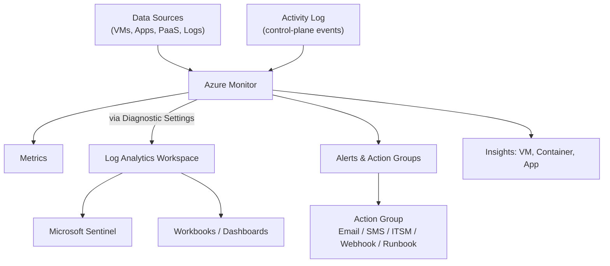
```mermaid
graph TD
    Sources["Data Sources\n(VMs, Apps, PaaS, Logs)"] --> Monitor[Azure Monitor]
    ActivityLog["Activity Log\n(control-plane events)"] --> Monitor
    Monitor --> Metrics[Metrics]
    Monitor -->|"via Diagnostic Settings"| Logs[Log Analytics Workspace]
    Monitor --> Alerts[Alerts & Action Groups]
    Monitor --> Insights[Insights: VM, Container, App]
    Logs --> Sentinel[Microsoft Sentinel]
    Logs --> Workbooks[Workbooks / Dashboards]
    Alerts --> AG[Action Group\nEmail / SMS / ITSM / Webhook / Runbook]
```

---

## Key Services

| Service | Purpose | Key Concepts |
| --- | --- | --- |
| **Azure Monitor** (umbrella: Activity Log, Metrics, Alerts, Diagnostic Settings, Insights family) | Central telemetry platform | Metrics, Logs, Alerts, Workbooks |
| **Log Analytics Workspace** (contains: KQL engine, retention tiers; fed via Diagnostic Settings) | Store and query logs (KQL) | Retention (30–730 days), data export |
| **Application Insights** (contains: Live Metrics, Availability Tests, Dependency Tracking, Smart Detection) | APM for apps | Live metrics, dependency tracking, availability tests |
| **VM Insights** | Perf + map for VMs | Relies on Log Analytics agent/AMA |
| **Container Insights** | AKS monitoring | Pod/node metrics, log collection |
| **Network Watcher** | Network diagnostics | Packet capture, flow logs, connection monitor |
| **Azure Advisor** | Best practice recommendations | Cost, security, reliability, performance |
| **Service Health** | Azure platform health | Planned maintenance, incidents |
| **Resource Health** | Your resource health | Is *your* resource healthy right now |

---

## Alerts

| Type | Trigger | Use Case |
| --- | --- | --- |
| **Metric Alert** | Threshold on metric value | CPU > 80%, response time > 2s |
| **Log Alert** | KQL query result count/value | Error count in last 5 min > 10 |
| **Activity Log Alert** | Azure control-plane events | Who deleted a resource, policy assignment (Activity Log is a sub-component of Azure Monitor, routed to Log Analytics via Diagnostic Settings) |
| **Smart Detection** | AI-based anomaly in App Insights | Failure rate spikes, perf degradation |

> **Action Groups** decouple alert routing from alert rules. One action group → multiple rules.

> **Exam tip:** When an answer option names a specific sub-component (e.g. Activity Log,
> Live Metrics, Smart Detection), prefer it over the umbrella service (e.g. Azure Monitor,
> Application Insights). Select the umbrella only when the sub-component is absent from
> the options.

---

## Diagnostic Settings

- Send to: **Log Analytics Workspace**, **Storage Account**, **Event Hub**, **Partner solution**
- Configure per resource (or via Azure Policy at scale)
- Categories: AllMetrics, Audit, Operational, **Activity Log** (control-plane events), etc.
- Activity Log is a sub-component of Azure Monitor routed to Log Analytics Workspace via Diagnostic Settings — not a standalone service.

---

> **Exam tip (AZ-500):** Diagnostic Settings are the bridge between Azure
> resources and Microsoft Sentinel. Route Activity Logs, Entra audit logs, and
> resource diagnostic logs to a Log Analytics Workspace that Sentinel reads from.
> Without Diagnostic Settings configured, Sentinel data connectors receive no data.

## Log Analytics Retention & Cost Tiers

| Tier | Type | Best For | Key Feature |
| --- | --- | --- | --- |
| **Analytics** | Interactive (30–730 days) | Active investigation, alerting | Full KQL, per-GB ingestion cost |
| **Basic** | Interactive (8 days) | High-volume, low-value logs | Limited KQL, lower per-GB cost |
| **Archive** | Cold (up to 12 years) | Compliance, audit, cold storage | Search jobs only, lowest per-GB cost |

> **Exam tip:** Choose Basic tier for noisy, rarely queried logs (e.g. verbose diagnostics)
> to reduce cost. Use Archive when retention beyond 730 days is required for compliance;
> queries against archived data run as Search Jobs, not interactive KQL.

---

# COMPUTE

> Also relevant for: **AZ-900** (VM, App Service, and container concepts)
> and **AZ-104** (VM deployment, VMSS, App Service plans, AKS node pools).

## Compute Options

| Service | Type | Use Case |
| --- | --- | --- |
| **Azure Virtual Machines** | IaaS | Full OS control, lift-and-shift |
| **VM Scale Sets (VMSS)** | IaaS autoscale | Stateless workloads needing horizontal scale |
| **Azure App Service** | PaaS | Web apps, APIs, mobile backends |
| **Azure Functions** | Serverless | Event-driven, short-duration tasks |
| **Azure Container Instances (ACI)** | Container | Quick burst containers, no orchestration |
| **Azure Kubernetes Service (AKS)** | Container orchestration | Microservices, complex container workloads |
| **Azure Container Apps** | Serverless containers | Microservices without K8s complexity |
| **Azure Batch** | HPC jobs | Large parallel compute jobs |
| **Azure Spring Apps** | PaaS Java | Spring Boot microservices |

## Compute Decision Flow

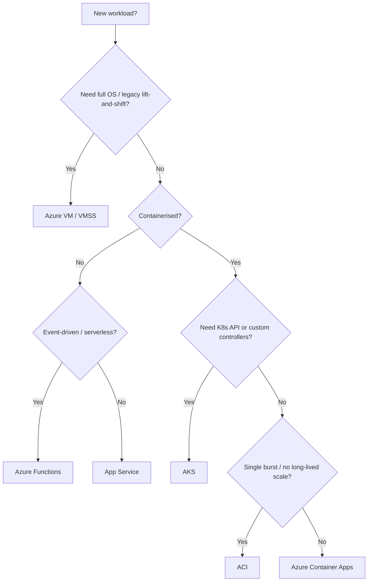
```mermaid
flowchart TD
    A[New workload?] --> B{Need full OS / legacy lift-and-shift?}
    B -- Yes --> VM[Azure VM / VMSS]
    B -- No --> C{Containerised?}
    C -- No --> D{Event-driven / serverless?}
    D -- Yes --> AF[Azure Functions]
    D -- No --> AS[App Service]
    C -- Yes --> E{Need K8s API or custom controllers?}
    E -- Yes --> AKS[AKS]
    E -- No --> F{Single burst / no long-lived scale?}
    F -- Yes --> ACI[ACI]
    F -- No --> ACA[Azure Container Apps]
```

> **Exam tip:** Start with OS control (VM), then container vs. code, then
> serverless vs. always-on. ACA is the default for containerised
> microservices when you do not need full Kubernetes API access.

---

## App Service Plans (Tiers)

| Tier | Category | Features |
| --- | --- | --- |
| **Free / Shared (F1/D1)** | Dev/Test | No SLA, shared infra, no custom domain SSL |
| **Basic (B1–B3)** | Dev/Test | Dedicated VMs, manual scale (up to 3 instances) |
| **Standard (S1–S3)** | Production | Auto-scale, custom domain, SSL, deployment slots (5) |
| **Premium (P1v3–P3v3)** | Production | More RAM/CPU, VNet integration, 20 deployment slots |
| **Isolated (I1v2–I3v2)** | Mission-critical | Dedicated ASE, VNet isolated, 100 instances |

> Deployment slots only available on **Standard** tier and above.

---

## Azure Functions Hosting Plans

| Plan | Scale | Cold Start | Use Case |
| --- | --- | --- | --- |
| **Consumption** | Auto (0 to N) | Yes | Sporadic, unpredictable traffic |
| **Premium** | Pre-warmed instances | No | No cold start, VNet, longer execution |
| **Dedicated (App Service)** | Manual / autoscale | No | Predictable load, reuse existing plan |

---

## Serverless / Event-Driven Selection

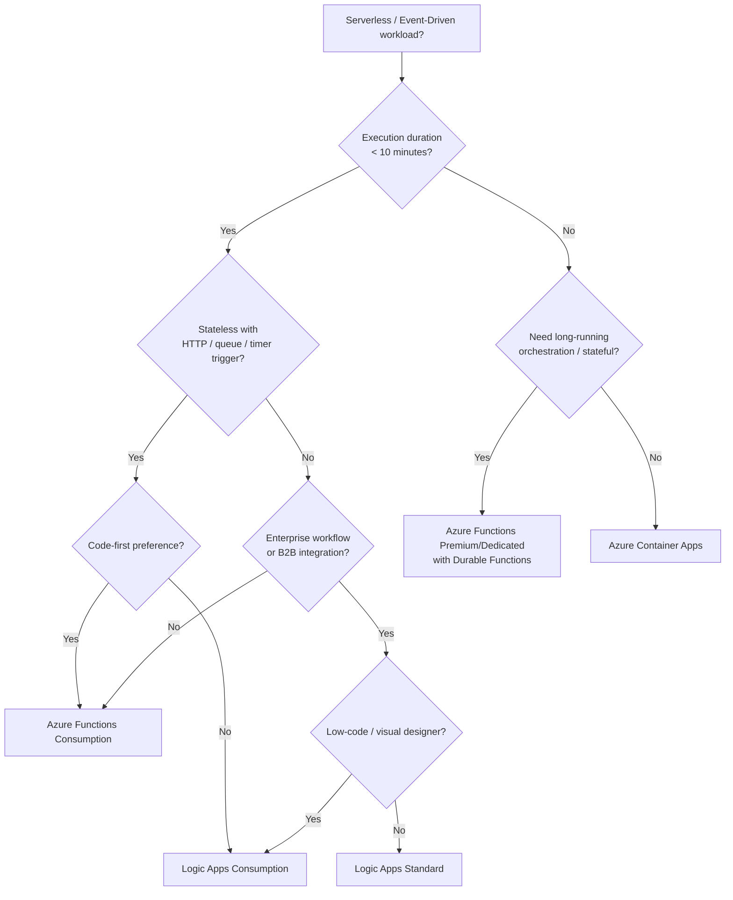
```mermaid
flowchart TD
    A[Serverless / Event-Driven workload?] --> B{Execution duration\n< 10 minutes?}
    B -- Yes --> C{Stateless with\nHTTP / queue / timer trigger?}
    B -- No --> D{Need long-running\norchestration / stateful?}
    C -- Yes --> E{Code-first preference?}
    C -- No --> F{Enterprise workflow\nor B2B integration?}
    D -- Yes --> DURABLE[Azure Functions Premium/Dedicated\nwith Durable Functions]
    D -- No --> ACA_LONG[Azure Container Apps]
    E -- Yes --> FUNC_CONS[Azure Functions Consumption]
    E -- No --> LOGIC_CONS[Logic Apps Consumption]
    F -- Yes --> G{Low-code / visual designer?}
    F -- No --> FUNC_CONS
    G -- Yes --> LOGIC_CONS
    G -- No --> LOGIC_STD[Logic Apps Standard]
```

> **Exam tip:** Use Azure Functions (Consumption) for short-lived, stateless, code-first triggers.
> Use Durable Functions (Premium/Dedicated) for stateful orchestration or fan-out patterns.
> Use Logic Apps Consumption for simple enterprise/B2B workflows with low-code connectors.
> Use Logic Apps Standard when you need ISE-like VNet isolation or single-tenant deployment.
> Use Azure Container Apps when execution duration exceeds Functions limits or you need a custom runtime.

---

## Azure Container Apps vs AKS vs ACI

| Dimension | ACI | ACA | AKS |
| --- | --- | --- | --- |
| **Control plane** | None — single container group | Managed (Envoy/KEDA/Dapr hidden) | Full K8s API access |
| **Scale trigger** | Manual / ARM template | KEDA (HTTP, queue, cron, custom) | HPA / KEDA (self-managed) |
| **Dapr integration** | No | Native sidecar injection | Manual Dapr install |
| **Revision management** | No | Yes — traffic split across revisions | Rolling deploy via K8s |
| **VNet integration** | Yes (inject into subnet) | Yes (environment-level) | Yes (CNI plugin) |
| **Cost model** | Per second, vCPU + memory | Per vCPU-s + memory-s (scale to zero) | Node pool VMs (always on) |
| **Ops overhead** | Minimal | Low | High (cluster upgrades, node pools) |

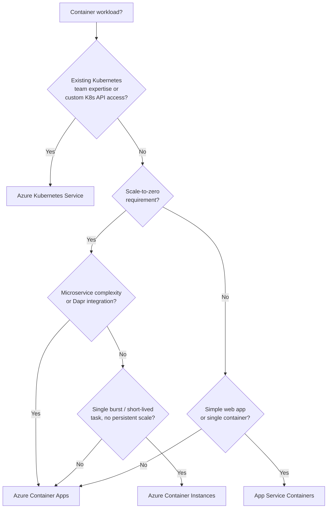
```mermaid
flowchart TD
    A[Container workload?] --> B{Existing Kubernetes\nteam expertise or\ncustom K8s API access?}
    B -- Yes --> AKS[Azure Kubernetes Service]
    B -- No --> C{Scale-to-zero\nrequirement?}
    C -- Yes --> D{Microservice complexity\nor Dapr integration?}
    C -- No --> E{Simple web app\nor single container?}
    D -- Yes --> ACA[Azure Container Apps]
    D -- No --> F{Single burst / short-lived\ntask, no persistent scale?}
    F -- Yes --> ACI[Azure Container Instances]
    F -- No --> ACA
    E -- Yes --> APPSVC[App Service Containers]
    E -- No --> ACA
```

> **Exam tip:** ACA uses KEDA under the hood and supports **scale-to-zero** for HTTP and
> queue-based triggers — similar to Consumption plan Functions but for containerised workloads.
> Choose ACA over Functions when you need a custom runtime, Dapr service invocation, or
> revision-based traffic splitting. Choose AKS when the scenario requires direct Kubernetes
> API access, custom admission webhooks, or specific CNI configuration.
> Choose App Service Containers for simple, single-container web apps that benefit from
> built-in deployment slots and App Service features without microservice overhead.
> Use ACI for one-off batch jobs or CI/CD pipeline steps that need an isolated container burst.

---

## Virtual Machine SKU Families

| Family | Purpose |
| --- | --- |
| **D-series** | General purpose — balanced CPU/memory |
| **E-series** | Memory optimized — databases, caches |
| **F-series** | Compute optimized — batch, game servers |
| **N-series** | GPU — AI/ML, rendering |
| **L-series** | Storage optimized — NoSQL, data warehousing |
| **M-series** | Large memory — SAP HANA |
| **B-series** | Burstable — dev/test, low-sustained CPU |

---

## Caching

### Azure Cache for Redis

| Tier | Replication | Clustering | Use Case | Key Feature |
|---|---|---|---|---|
| Basic | No | No | Dev/test only | Single node, no SLA |
| Standard | Yes (primary + replica) | No | Production general | 99.9% SLA, failover |
| Premium | Yes | Yes (up to 10 shards) | High throughput, persistence | VNet, geo-replication, RDB/AOF |
| Enterprise | Yes | Yes (OSS Redis cluster) | Ultra-low latency, RediSearch | Active geo-replication, 99.999% SLA |
| Enterprise Flash | Yes | Yes | Large datasets, cost optimisation | NVMe + DRAM tiering |

> **Exam tip:** Choose Premium when VNet injection or geo-replication is required.
> Choose Enterprise when active-active multi-region or RediSearch/RedisBloom modules are needed.

**Eviction policies (exam-relevant):**

- `volatile-lru` — evict least-recently-used keys that have a TTL set (default safe choice)
- `allkeys-lru` — evict any LRU key (use when all keys are equally expendable)
- `noeviction` — return errors when memory is full (use for session stores where data loss is unacceptable)

#### Tier Selection Decision Flow

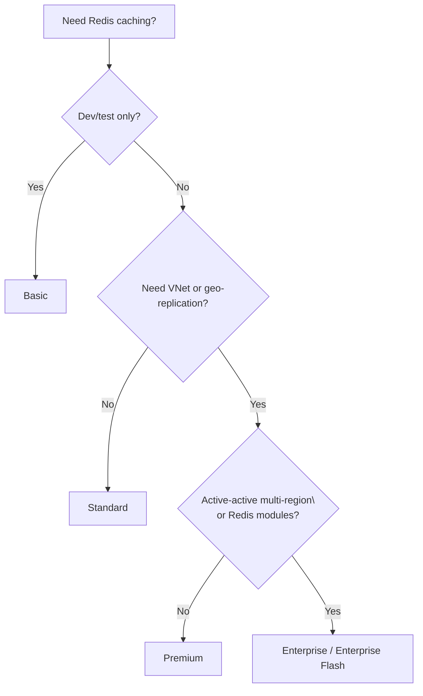
```mermaid
flowchart TD
    A[Need Redis caching?] --> B{Dev/test only?}
    B -- Yes --> C[Basic]
    B -- No --> D{Need VNet or geo-replication?}
    D -- No --> E[Standard]
    D -- Yes --> F{Active-active multi-region\\nor Redis modules?}
    F -- No --> G[Premium]
    F -- Yes --> H[Enterprise / Enterprise Flash]
```

---

# IDENTITY & ACCESS

> Also relevant for: **AZ-900** (Entra ID basics, authentication concepts) and
> **AZ-104** (RBAC assignments, role definitions, Managed Identity administration).

## Entra ID (Azure AD) Concepts

| Concept | Description |
| --- | --- |
| **Tenant** | Dedicated Entra ID instance for org |
| **User** | Human identity |
| **Service Principal** | App identity (manual credential management) |
| **Managed Identity** | Azure-managed service principal — no credentials |
| **System-Assigned MI** | Tied to resource lifecycle, auto-deleted |
| **User-Assigned MI** | Independent lifecycle, shared across resources |
| **Groups** | Security or M365, for role assignment |
| **App Registration** | Define an application in Entra ID |

---

## Entra Identity Scenarios

| Scenario | Solution | Tenant Type |
| --- | --- | --- |
| Employee / workforce identity | Entra ID (workforce tenant) | Workforce |
| Partner / vendor B2B access | Entra B2B (guest users) | Workforce |
| Customer-facing app identity | Entra External ID (external tenant) | External / CIAM |

> **Exam tip:** Entra External ID is the successor to Azure AD B2C for new customer identity
> (CIAM) projects. Existing B2C tenants continue to be supported, but new designs should target
> Entra External ID (external tenant). Do not confuse B2B guest users (workforce tenant) with
> External ID (separate external tenant).

## Hybrid Identity

| Service | Purpose | Protocol | Use Case | Key Feature |
| --- | --- | --- | --- | --- |
| **Entra Connect** | Sync on-prem AD identities to Entra ID | LDAP → OAuth/OIDC | Hybrid orgs needing SSO across on-prem and cloud | Password hash sync, pass-through auth, federation |
| **Entra Domain Services** | Managed domain services in Azure (no DCs to run) | LDAP / Kerberos / NTLM | Lift-and-shift apps requiring legacy auth in Azure | Fully managed, integrates with Entra ID tenant |
| **Entra ID-only** | Cloud-native identity with no on-prem dependency | OAuth 2.0 / OIDC / SAML | Greenfield cloud workloads | No infrastructure to manage |

> **Exam tip:** Choose Entra Domain Services when a lift-and-shift workload requires LDAP or
> Kerberos authentication in Azure and you do not want to deploy and manage domain controllers.
> Choose Entra Connect when the requirement is to sync existing on-premises Active Directory
> accounts to the cloud for SSO or hybrid authentication.

---

## RBAC

| Concept | Description |
| --- | --- |
| **Role Definition** | Set of allowed actions (e.g. Contributor) |
| **Role Assignment** | Assign role to principal at a scope |
| **Scope levels** | Management Group > Subscription > Resource Group > Resource |
| **Built-in roles** | Owner, Contributor, Reader, User Access Administrator |
| **Custom Roles** | Define your own action list |
| **Deny Assignments** | Block actions regardless of role (used by Blueprints) |

> **⚠️ Deprecation warning:** Vault Access Policies (Key Vault) and legacy Storage access
> policies are superseded by **Azure RBAC**. RBAC is Entra-native, auditable, and centrally
> managed. Migrate new and existing resources to RBAC.

---

## PIM Key Concepts

| Feature | Detail |
| --- | --- |
| **Eligible Assignment** | Role not active until user activates |
| **Active Assignment** | Role always active |
| **Activation** | User requests role, optionally requires MFA + justification |
| **Approval Workflow** | Require approver before activation |
| **Access Reviews** | Periodic certify that users still need roles |

---

> **Exam tip (AZ-500):** AZ-500 tests PIM activation depth — know the difference
> between eligible (requires activation) and active (always on) role assignments.
> Access Reviews are the recurring compliance mechanism; PIM is the just-in-time
> access mechanism. Conditional Access is the Zero Trust policy enforcement point
> — combine it with Identity Protection risk signals to auto-block risky sign-ins.

# HIGH AVAILABILITY & DISASTER RECOVERY

> Also relevant for: **AZ-104** (Availability Sets, Availability Zones, Backup,
> Site Recovery administration).

## Key Concepts

| Term | Definition |
| --- | --- |
| **RTO** | Recovery Time Objective — max acceptable downtime |
| **RPO** | Recovery Point Objective — max acceptable data loss (time) |
| **SLA** | Uptime guarantee; VMs need 2+ instances for 99.9%+ |
| **Availability Set** | Fault + update domain spread within a datacenter |
| **Availability Zone** | Physically separate datacenter in same region |
| **Region Pair** | Microsoft-paired regions for geo-replication |

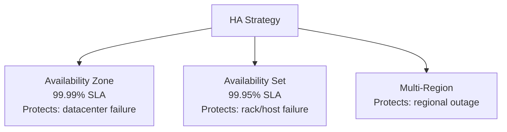
```mermaid
graph TD
    H[HA Strategy] --> AZ[Availability Zone\n99.99% SLA\nProtects: datacenter failure]
    H --> AS[Availability Set\n99.95% SLA\nProtects: rack/host failure]
    H --> AR[Multi-Region\nProtects: regional outage]
```

---

## Azure Site Recovery (ASR)

| Feature | Detail |
| --- | --- |
| **Purpose** | Replicate VMs to secondary region for DR |
| **RPO** | As low as 30 seconds (crash-consistent) |
| **RTO** | Minutes (orchestrated failover) |
| **Test Failover** | Validate DR without impacting production |
| **Supported sources** | Azure VMs, VMware, Hyper-V, Physical servers |

---

## Azure Backup

| Workload | Vault Type | Key Feature |
| --- | --- | --- |
| Azure VMs | Recovery Services Vault | App-consistent snapshots |
| Azure SQL | Recovery Services Vault | Full/diff/log backup, PITR |
| Azure Files | Recovery Services Vault | Share-level snapshots |
| Azure Blobs | Backup Vault | Operational backup (no vault egress) |
| PostgreSQL / MySQL | Backup Vault | Managed DB backup |

> **⚠️ Deprecation warning:** Recovery Services Vault is the legacy backup store (VMs, SQL
> in VM, Azure Files). For new PaaS-based backup targets (Blobs, managed databases), use
> **Backup Vault** — Microsoft's current backup store model.

---

# GOVERNANCE

> Also relevant for: **AZ-104** (RBAC assignments, Policy definitions,
> Management Groups, Blueprints administration).

## Management Hierarchy

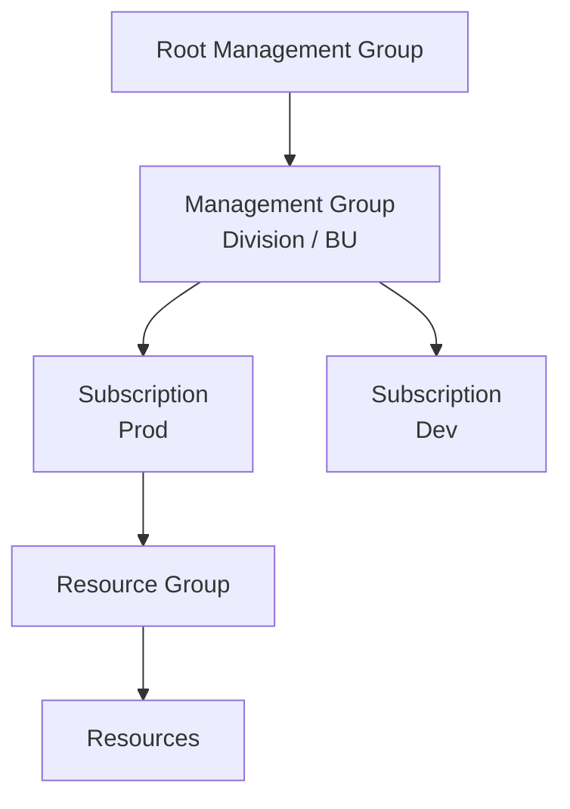
```mermaid
graph TD
    Root[Root Management Group]
    Root --> MG1[Management Group\nDivision / BU]
    MG1 --> Sub1[Subscription\nProd]
    MG1 --> Sub2[Subscription\nDev]
    Sub1 --> RG1[Resource Group]
    RG1 --> R1[Resources]
```

| Scope | Purpose |
| --- | --- |
| **Root Management Group** | Apply policies across entire tenant |
| **Management Group** | Group subscriptions, inherit policies |
| **Subscription** | Billing boundary, policy scope |
| **Resource Group** | Lifecycle boundary — deploy/delete together |

---

## Azure Blueprints vs ARM Templates vs Terraform

| Tool | Purpose | Drift Detection | State | Status |
| --- | --- | --- | --- | --- |
| **ARM Templates** | Deploy resources declaratively | No | Stateless | Active |
| **Bicep** | ARM simplified syntax | No | Stateless | Active |
| **Terraform** | Multi-cloud IaC | Yes (plan) | Stateful | Active |
| **Azure Blueprints** | Governance packages (policy + RBAC + ARM) | Partial (locking) | Artifact-tracked | **RETIRED July 2026** |

> **⚠️ Deprecation warning:** Azure Blueprints is retired (11 July 2026). Migrate to:
>
> - **ARM/Bicep Template Specs** — for reusable, versioned IaC artifacts.
> - **Azure Policy** — for compliance rules and auto-remediation.
> - **RBAC** — for role assignments and least-privilege access.
> Use all three together to replicate what a Blueprint provided as a single package.
>
> See: [Microsoft retirement announcement](https://azure.microsoft.com/en-us/updates/azure-blueprints-is-being-retired-on-11-july-2026/)

> **Exam tip:** Questions about Blueprints reference legacy or existing environments. For new governance designs always specify Template Specs + Policy + RBAC as the replacement pattern.

---

## Cost Management

| Tool | Purpose |
| --- | --- |
| **Azure Cost Management** | View, analyze, alert on spending |
| **Budgets** | Set spend thresholds, trigger alerts/actions |
| **Azure Advisor (Cost)** | Right-sizing and reservation recommendations |
| **Reserved Instances** | 1 or 3 year commit — up to 72% savings |
| **Spot VMs** | Evictable — up to 90% savings for fault-tolerant workloads |
| **Azure Hybrid Benefit** | Use existing Windows Server / SQL licenses |

---

## Tags

- Applied at: Resource, Resource Group, Subscription level
- Inherited? **No** — tags don't inherit by default (use Azure Policy to enforce inheritance)
- Max: 50 tags per resource
- Use cases: cost center, environment, owner, project

---

## Locks

| Lock Type | Prevents |
| --- | --- |
| **ReadOnly** | All write operations (create, update, delete) — read access only |
| **CanNotDelete** | Delete only — updates still allowed |

> Locks are inherited by child resources. Applied at resource, resource group, or subscription.
>
> Source: [Azure Lock Resources — Microsoft Learn](https://learn.microsoft.com/en-us/azure/azure-resource-manager/management/lock-resources)

---

> **Exam tip (AZ-500):** Azure Policy is the primary compliance enforcement tool
> in AZ-500 — know Deny (blocks creation), Audit (flags without blocking), and
> DeployIfNotExists (auto-remediates). Resource Locks (ReadOnly / Delete) protect
> against accidental change or deletion but do not enforce configuration compliance.

# MESSAGING & INTEGRATION

> Also relevant for: **AZ-104** (Service Bus namespace administration,
> Event Grid subscriptions).

## Service Comparison

| Service | Pattern | Ordering | Replay | Use Case |
| --- | --- | --- | --- | --- |
| **Service Bus Queue** | Message (P2P) | FIFO optional | No | Reliable command delivery |
| **Service Bus Topic** | Message (pub/sub) | FIFO optional | No | Fan-out with filters |
| **Event Grid** | Event (reactive) | No | No | Resource change reactions |
| **Event Hub** | Stream (telemetry) | Per-partition | Yes (retention) | IoT, log ingestion |
| **Storage Queue** | Message (P2P) | Best-effort | No | Simple, cheap async |

## Decision Flowchart

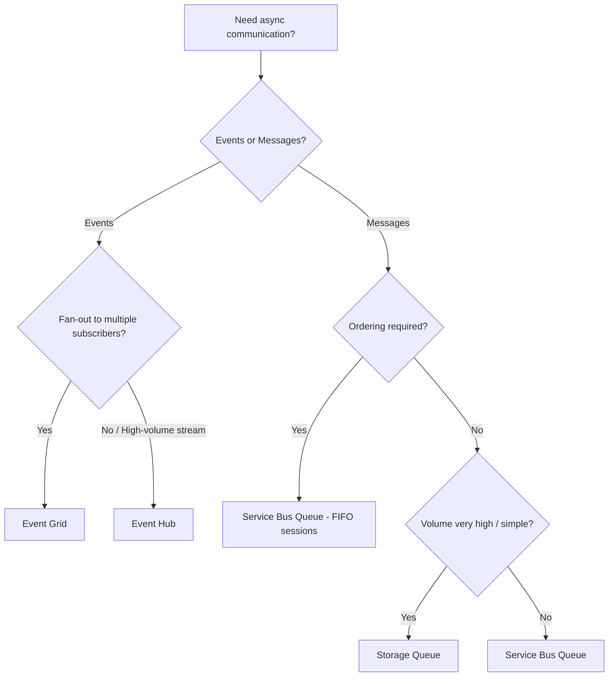
```mermaid
flowchart TD
    A[Need async communication?] --> B{Events or Messages?}
    B -- Events --> C{Fan-out to multiple subscribers?}
    B -- Messages --> D{Ordering required?}
    C -- Yes --> E[Event Grid]
    C -- No / High-volume stream --> F[Event Hub]
    D -- Yes --> G[Service Bus Queue - FIFO sessions]
    D -- No --> H{Volume very high / simple?}
    H -- Yes --> I[Storage Queue]
    H -- No --> J[Service Bus Queue]
```

## Logic Apps vs Azure Functions vs Durable Functions

| Service | Best For | Trigger Model | State | Pricing Model |
| --- | --- | --- | --- | --- |
| **Logic Apps** | Low-code workflow automation, SaaS connectors | Event / Schedule / HTTP | Stateful (built-in) | Per-action / consumption |
| **Azure Functions** | Stateless compute, event-driven microservices | Many triggers (HTTP, queue, timer, etc.) | Stateless by default | Consumption / Premium |
| **Durable Functions** | Long-running, stateful orchestrations in code | Orchestrator / Activity / Entity | Stateful (via storage) | Consumption (includes storage cost) |

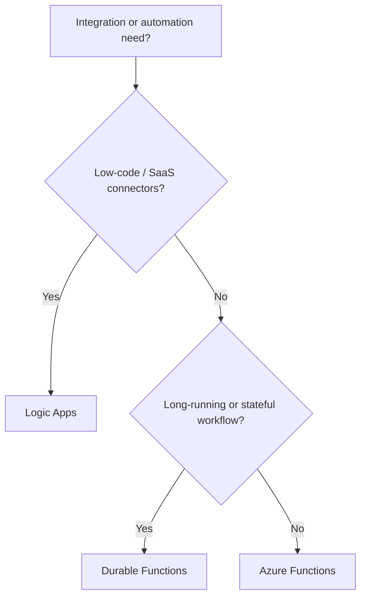
```mermaid
flowchart TD
    A[Integration or automation need?] --> B{Low-code / SaaS connectors?}
    B -- Yes --> LA[Logic Apps]
    B -- No --> C{Long-running or stateful workflow?}
    C -- Yes --> DF[Durable Functions]
    C -- No --> AF[Azure Functions]
```

> **Exam tip:** Choose Logic Apps when the requirement mentions low-code orchestration or pre-built SaaS connectors. Choose Durable Functions for long-running, stateful, or fan-out/fan-in patterns written in code. Choose Azure Functions for stateless, event-driven compute with no orchestration requirement.

## Exam Tips

> **Dead-Letter Queues (DLQ):** Messages are moved to the DLQ when TTL expires, max delivery count is exceeded, or the message is explicitly dead-lettered by the receiver. Monitor DLQ depth via Azure Monitor metrics or Service Bus Explorer — a growing DLQ indicates poison messages or consumer failures.

> **Sessions & Partitioning:** Enable sessions on a Service Bus queue/topic to guarantee ordered processing per session key — all messages with the same session ID are delivered to the same consumer in order. Enable partitioning to distribute load across multiple message brokers and increase throughput; note that sessions and partitioning can be combined but partitioned entities have a 1 GB size limit per partition.

> **Consumer Groups & Retention (Event Hub):** Each consumer group maintains its own independent offset/cursor, allowing multiple downstream systems to read the same stream at their own pace without interference. Configure retention (1–90 days, up to 7 days on Standard tier) to enable event replay for late-joining consumers, reprocessing after failures, or auditing.

---

*Last updated for AZ-305 exam preparation — review official Microsoft Learn documentation for latest service updates.*

---

# WELL-ARCHITECTED FRAMEWORK

> **Exam Focus:** Use WAF pillars to *justify* design decisions in
> case-study questions — not just to name the correct service.
> Relevant for **AZ-305** only; not assessed in AZ-900 or AZ-104.

## Five-Pillar Summary

| Pillar | Goal | Key Azure Services / Patterns | Exam Focus |
| --- | --- | --- | --- |
| Reliability | Survive failures; meet SLA targets | Availability Zones, Traffic Manager, Azure Site Recovery | AZ vs AS vs Multi-Region; RTO/RPO targets |
| Security | Protect data, identities, and workloads | Microsoft Entra ID, Defender for Cloud, Key Vault, DDoS | Zero Trust; defence-in-depth layers |
| Cost Optimization | Maximise value; eliminate waste | Reserved Instances, Spot VMs, Azure Advisor, Cost Budgets | RI vs Spot vs On-Demand trade-offs |
| Operational Excellence | Safe deployments; observable operations | Azure Monitor, Log Analytics, Deployment Slots, IaC | Blue/green deploys; alerting strategy |
| Performance Efficiency | Scale to meet demand; minimise latency | Azure CDN, Front Door, VMSS, Cosmos DB, Redis Cache | Horizontal vs vertical scale; caching layers |

> **Cross-reference:** See [High Availability & Disaster Recovery](#high-availability--disaster-recovery) for Reliability patterns, [Security](#security) for defence-in-depth, [Networking — CDN](#content-delivery-cdn) for CDN/Front Door, [Compute — Caching](#caching) for Redis tier selection, [Networking](#networking) for DDoS, and [Governance](#governance) for cost control tooling.

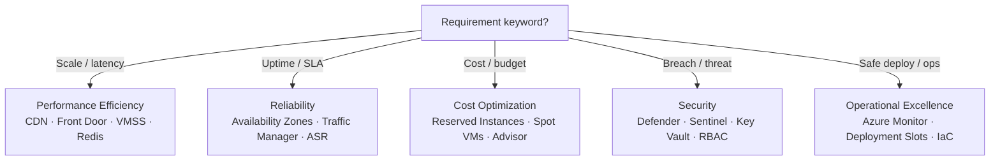
```mermaid
flowchart TD
    A[Requirement keyword?] -->|Scale / latency| B[Performance Efficiency\nCDN · Front Door · VMSS · Redis]
    A -->|Uptime / SLA| C[Reliability\nAvailability Zones · Traffic Manager · ASR]
    A -->|Cost / budget| D[Cost Optimization\nReserved Instances · Spot VMs · Advisor]
    A -->|Breach / threat| E[Security\nDefender · Sentinel · Key Vault · RBAC]
    A -->|Safe deploy / ops| F[Operational Excellence\nAzure Monitor · Deployment Slots · IaC]
```

### Decision Flow — Pillar Trade-off Navigator

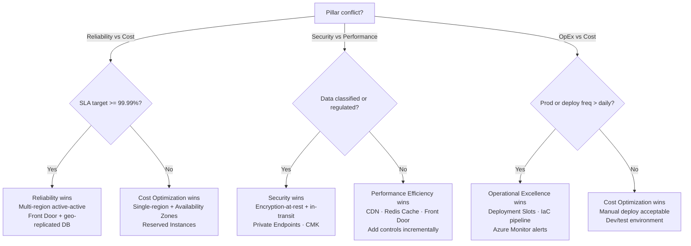
```mermaid
flowchart TD
    C1[Pillar conflict?] -->|Reliability vs Cost| RC{SLA target >= 99.99%?}
    RC -->|Yes| RC_Y[Reliability wins\nMulti-region active-active\nFront Door + geo-replicated DB]
    RC -->|No| RC_N[Cost Optimization wins\nSingle-region + Availability Zones\nReserved Instances]
    C1 -->|Security vs Performance| SP{Data classified or regulated?}
    SP -->|Yes| SP_Y[Security wins\nEncryption-at-rest + in-transit\nPrivate Endpoints · CMK]
    SP -->|No| SP_N[Performance Efficiency wins\nCDN · Redis Cache · Front Door\nAdd controls incrementally]
    C1 -->|OpEx vs Cost| OC{Prod or deploy freq > daily?}
    OC -->|Yes| OC_Y[Operational Excellence wins\nDeployment Slots · IaC pipeline\nAzure Monitor alerts]
    OC -->|No| OC_N[Cost Optimization wins\nManual deploy acceptable\nDev/test environment]
```

---

## Reliability — SLA Target Mapping

| SLA Target | Recommended Deployment Pattern | Notes |
| --- | --- | --- |
| 99.9 % | Single region, Availability Set | Protects against rack/host failure; no zone fault |
| 99.95 % | Single region, Availability Zones | Protects against datacenter-level failure |
| 99.99 %+ | Multi-region (active-active/passive) | Requires Traffic Manager or Front Door for routing |

> **Exam tip:** Availability Zones ≠ Availability Sets. AZs span separate
> datacenters; AS only separate fault/update domains within one datacenter.

### Composite SLA Calculation

Composite SLA = SLA₁ × SLA₂ × … × SLAₙ (serial dependencies multiply downward).

**Worked example:** App Service 99.95 % × SQL Database 99.99 % = **99.94 %**
(monthly downtime budget drops from ~4.4 min to ~26 min).

Adding redundant independent paths raises the composite SLA:
Composite = 1 − (1 − SLA₁) × (1 − SLA₂) for parallel components.

### Multi-Region Failover Patterns

| Pattern | RTO | RPO | Azure Implementation | Key Feature |
| --- | --- | --- | --- | --- |
| Active-Active | Near zero | Near zero | Front Door + globally distributed backends | Traffic split across regions; no failover lag |
| Active-Passive (warm) | Minutes | Seconds–minutes | Traffic Manager + pre-provisioned standby region | Standby receives replication but serves no live traffic |
| Active-Passive (cold) | Hours | Minutes–hours | Azure Site Recovery + on-demand provisioning | Lowest cost; longest recovery time |

> **Exam tip:** Choose active-active when the requirement states RTO ≈ 0 or
> "no downtime tolerated". Choose active-passive (warm) when cost must be
> controlled but recovery must complete within minutes. Use composite SLA
> multiplication to verify the architecture meets the stated SLA target.

---

## Cost Optimization — Compute Pricing Model Selection

| Option | Best For | Commitment | Interruption Risk |
| --- | --- | --- | --- |
| On-Demand (Pay-as-go) | Unpredictable workloads, short-term dev/test | None | None |
| Reserved Instances | Steady-state, 24/7 production workloads | 1 or 3 years | None |
| Spot VMs | Fault-tolerant batch jobs, HPC, dev/test | None | Yes (eviction) |
| Azure Hybrid Benefit | Existing Windows Server / SQL Server licences | Bring own licence | None |

> **Tools:** Azure Advisor surfaces rightsizing and idle resource
> recommendations. Azure Budgets + Cost Alerts prevent spend overruns.
> See [Governance](#governance) for Policy and Budget configuration patterns.

---

> **Exam tip:** In case-study questions, every design decision maps to at
> least one WAF pillar. When asked *why* a solution is recommended, frame
> your answer using the pillar: "This satisfies the **Reliability** pillar
> because it adds zone redundancy, raising the composite SLA above 99.95 %."
