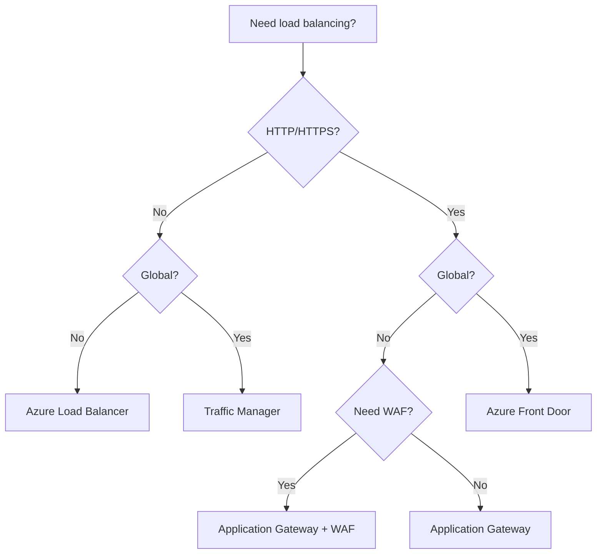
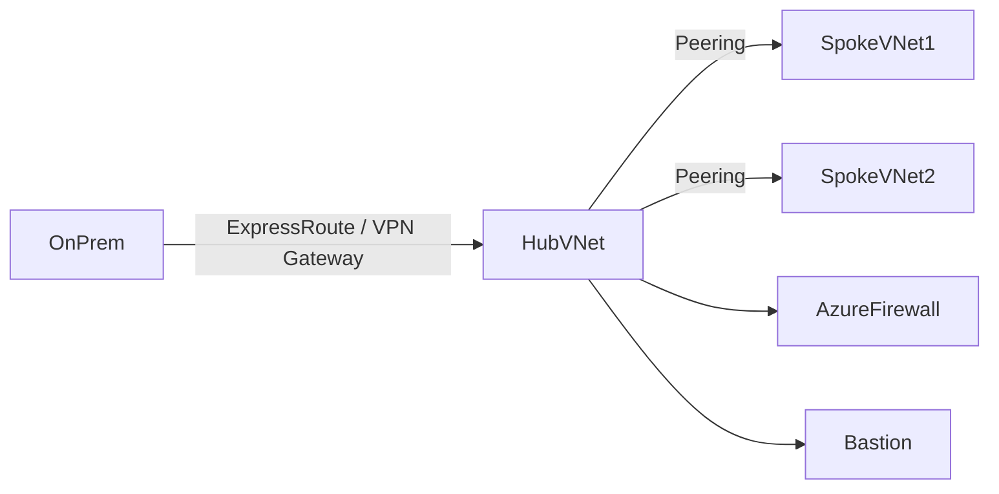
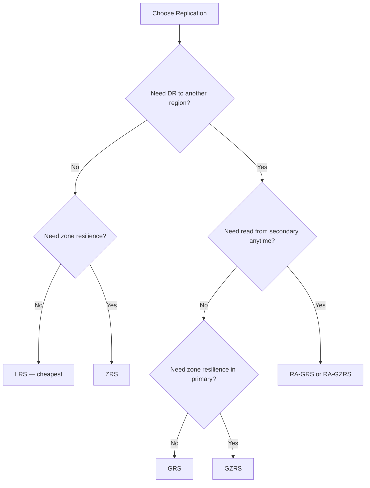
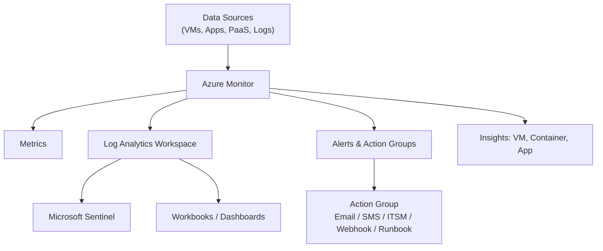
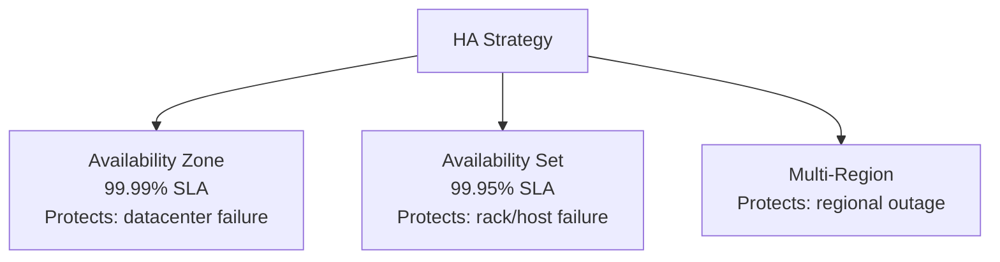
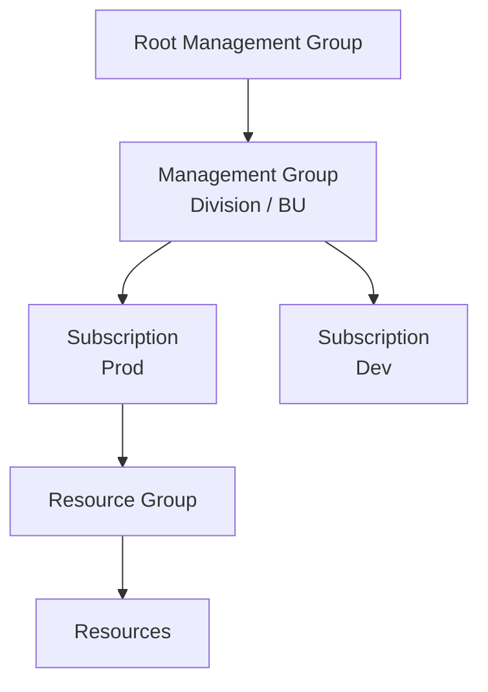
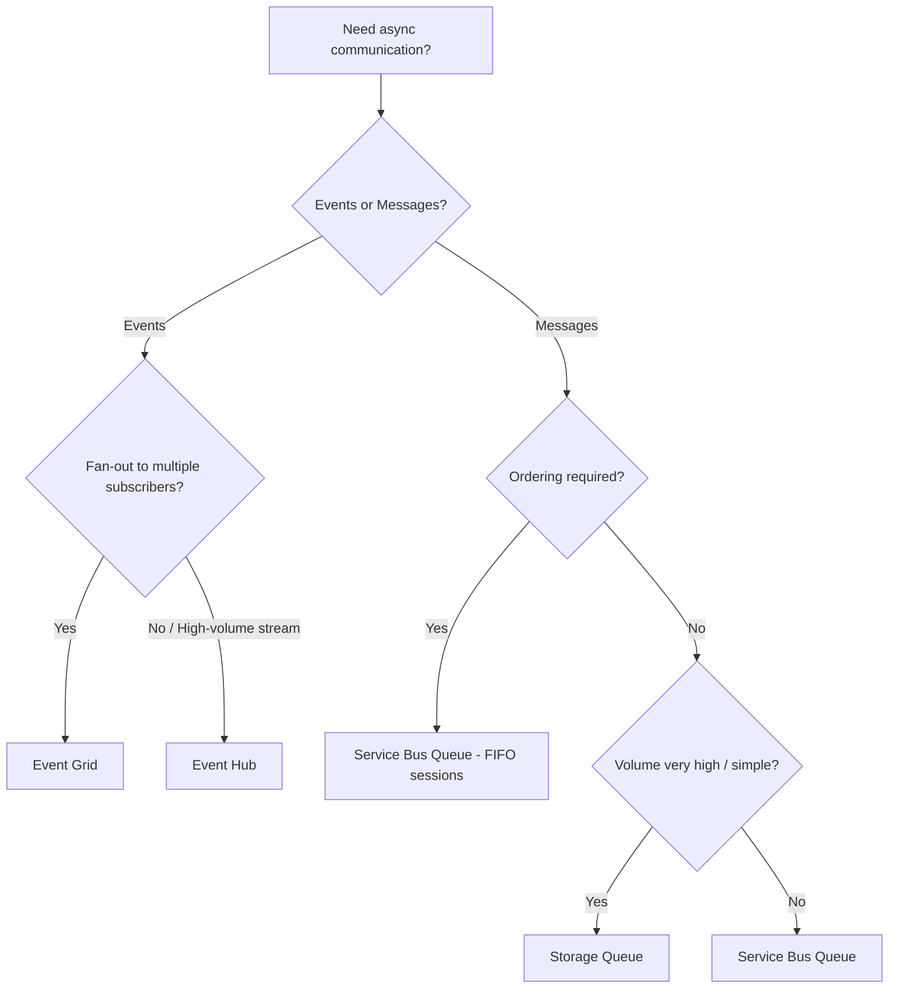

# Designing Microsoft Azure Infrastructure Solutions

## Comprehensive Cheat Sheet

> **Exam Focus:** Architectural decision-making — *which* service, *why*, *when*. Not how to configure.

---

## Table of Contents

1. [Networking](#networking)
2. [Security](#security)
3. [Storage](#storage)
4. [Monitoring & Observability](#monitoring--observability)
5. [Compute](#compute)
6. [Identity & Access](#identity--access)
7. [High Availability & Disaster Recovery](#high-availability--disaster-recovery)
8. [Governance](#governance)
9. [Messaging & Integration](#messaging--integration)

---

# NETWORKING

## Load Balancers

| Service | Layer | Scope | Use Case | Key Feature |
|---|---|---|---|---|
| **Azure Load Balancer** | L4 (TCP/UDP) | Regional | Internal or public VM load balancing | Low latency, non-HTTP |
| **Application Gateway** | L7 (HTTP/S) | Regional | Web apps, URL-based routing | WAF, SSL termination, cookie affinity |
| **Azure Front Door** | L7 (HTTP/S) | Global | Multi-region web apps, CDN+WAF | Anycast, global routing, WAF, CDN |
| **Traffic Manager** | DNS-based | Global | Non-HTTP global routing, failover | DNS TTL-based, not a proxy |
| **API Management** | L7 (HTTP/S) | Regional/Global | API gateway, rate limiting, auth | Policies, developer portal, caching |

### Decision Flow

---

## Virtual Networks (VNet)

| Concept | Description | Use Case |
|---|---|---|
| **VNet Peering** | Direct low-latency connection between VNets | Same or cross-region connectivity, no gateway needed |
| **VNet-to-VNet VPN** | Encrypted tunnel over public internet | Cross-region, cross-subscription (older pattern) |
| **ExpressRoute** | Private dedicated circuit via provider | Enterprise, compliance, predictable bandwidth |
| **VPN Gateway** | IPSec tunnel over internet | On-prem to Azure, cost-effective |
| **Azure Bastion** | Browser-based RDP/SSH via Azure portal | Secure jump-host, no public IP on VMs |
| **Private Endpoint** | Private IP for PaaS service in your VNet | Secure PaaS access, no public internet exposure |
| **Service Endpoint** | Extends VNet identity to PaaS service | Simpler than Private Endpoint, still uses public IP |

> **Private Endpoint vs Service Endpoint:**
>
> - Private Endpoint = PaaS resource gets a NIC in your VNet (true private)
> - Service Endpoint = traffic stays on Azure backbone but PaaS still has public IP

---

## DNS

| Service | Use Case |
|---|---|
| **Azure DNS** | Host public DNS zones in Azure |
| **Azure Private DNS Zones** | Name resolution within VNets |
| **Private DNS Resolver** | Hybrid DNS — forward on-prem queries to Azure Private DNS |

---

## Network Security

| Service | Purpose | Key Feature |
|---|---|---|
| **NSG (Network Security Group)** | Allow/deny traffic at NIC or subnet | Stateful, rules by port/IP/protocol |
| **Azure Firewall** | Managed L3-L7 network firewall | FQDN filtering, threat intel, centralized policy |
| **Azure Firewall Premium** | Advanced threat protection | TLS inspection, IDPS, URL filtering |
| **DDoS Protection Basic** | Always-on, free | Platform-level protection |
| **DDoS Protection Standard** | Enhanced mitigation + alerting | Per-VNet cost, SLA guarantee, telemetry |
| **Web Application Firewall (WAF)** | OWASP rules, custom rules | Deployed on App Gateway or Front Door |

> **NSG vs Azure Firewall:** NSG = subnet/NIC filtering. Azure Firewall = centralized, stateful, FQDN-aware.

---

## Connectivity Patterns

| Pattern | Description |
|---|---|
| **Hub-Spoke** | Central hub VNet with shared services (firewall, bastion, DNS), spokes per workload |
| **Virtual WAN** | Microsoft-managed hub-spoke at scale, with SD-WAN integration |

---

# SECURITY

## Microsoft Defender for Cloud

| Plan | Covers | Key Feature |
|---|---|---|
| **Defender for Servers** | VMs, Arc servers | Vulnerability assessment, JIT VM access |
| **Defender for Storage** | Blob, Files, ADLS | Malware scanning, anomaly detection |
| **Defender for SQL** | Azure SQL, SQL Server | SQL injection detection, anomalous access |
| **Defender for Containers** | AKS, ACR, Arc K8s | Image scanning, runtime threat detection |
| **Defender for App Service** | Web apps | Threat detection, malicious domain alerts |
| **Defender for Key Vault** | Key Vault | Suspicious access pattern alerts |
| **Defender for DNS** | DNS layer | Detect C2 communication |
| **Defender CSPM** | Cloud posture | Attack path analysis, governance |

---

## Azure Key Vault

| Feature | Detail |
|---|---|
| **Secrets** | Connection strings, passwords, API keys |
| **Keys** | Encryption keys (RSA, EC) — HSM-backed option |
| **Certificates** | Manage TLS/SSL lifecycle |
| **Soft Delete** | Retain deleted objects for 7–90 days |
| **Purge Protection** | Prevent permanent deletion during retention |
| **RBAC vs Access Policies** | RBAC preferred (granular, Azure AD-native) |
| **Private Endpoint** | Restrict Key Vault to VNet-only access |

> Exam tip: Always use **Managed Identity** to access Key Vault — never store credentials in app config.

---

## Encryption

| Type | Description | Service |
|---|---|---|
| **Encryption at rest** | Data encrypted on disk | Default in Azure Storage, SQL, etc. |
| **CMK (Customer-Managed Keys)** | You control key in Key Vault | Stricter compliance, storage + SQL |
| **PMK (Platform-Managed Keys)** | Microsoft manages key | Default, lower admin overhead |
| **Double Encryption** | Two layers of encryption | Azure Storage, Disks |
| **Encryption in transit** | TLS enforced | All Azure services |
| **Azure Disk Encryption** | BitLocker (Windows) / dm-crypt (Linux) | VM OS and data disks |
| **SSE (Server-Side Encryption)** | Storage service encrypts before writing | Azure Blob, Files, Queues |

---

## Policy & Compliance

| Concept | Description |
|---|---|
| **Azure Policy** | Enforce, audit, or remediate resource configurations |
| **Policy Initiative** | Group of policies (e.g., CIS benchmark) |
| **Deny Effect** | Block non-compliant resource creation |
| **Audit Effect** | Flag non-compliance without blocking |
| **DeployIfNotExists** | Auto-remediate — deploy missing configs |
| **Modify Effect** | Auto-add tags or properties |
| **Compliance Dashboard** | See % compliance across subscriptions |
| **Regulatory Compliance** | Pre-built initiatives: NIST, ISO 27001, PCI-DSS |

> Exam tip: **DeployIfNotExists** requires a managed identity for the policy assignment to execute remediation.

---

## Authentication & Password Security

| Feature | Description | Use Case |
|---|---|---|
| **MFA** | Multi-factor authentication | All users, especially admins |
| **Passwordless** | FIDO2 key, Microsoft Authenticator, Windows Hello | Zero-password auth |
| **Conditional Access** | Policy-based access decisions | Enforce MFA by location/risk/device |
| **Identity Protection** | Risk-based sign-in/user risk policies | Auto-block risky sign-ins |
| **SSPR (Self-Service Password Reset)** | Users reset their own passwords | Reduce helpdesk load |
| **Password Protection** | Block weak/known-bad passwords | On-prem AD + Azure AD |
| **PIM (Privileged Identity Management)** | Just-in-time privileged access | Admin roles activated on demand |
| **Access Reviews** | Periodic review of group/role membership | Compliance, least-privilege enforcement |

---

## Microsoft Sentinel

| Component | Purpose |
|---|---|
| **Data Connectors** | Ingest logs from Azure, M365, 3rd party |
| **Analytics Rules** | Detect threats from log patterns |
| **Playbooks (Logic Apps)** | Auto-respond to incidents |
| **Workbooks** | Visualize security data |
| **UEBA** | User and entity behavior analytics |
| **Threat Intelligence** | Feed-based IOC matching |

> Sentinel = SIEM + SOAR. Defender for Cloud = CSPM + workload protection. They integrate but serve different roles.

---

# STORAGE

## Storage Account Types

| Type | Supported Services | Use Case |
|---|---|---|
| **Standard GPv2** | Blob, File, Queue, Table | General purpose, most scenarios |
| **Premium Block Blobs** | Block Blob only | Low-latency blob I/O, analytics |
| **Premium File Shares** | Azure Files only | High-performance SMB/NFS shares |
| **Premium Page Blobs** | Page Blob only | Unmanaged VM disks |

---

## Blob Access Tiers

| Tier | Access Frequency | Storage Cost | Access Cost | Minimum Duration |
|---|---|---|---|---|
| **Hot** | Frequent | Highest | Lowest | None |
| **Cool** | Infrequent (≥30 days) | Lower | Higher | 30 days |
| **Cold** | Rare (≥90 days) | Lower still | Higher | 90 days |
| **Archive** | Very rare (≥180 days) | Lowest | Highest + rehydration | 180 days |

> Archive blobs must be **rehydrated** (hours) before access. Use Lifecycle Management policies to auto-tier.

---

## Replication Options

| Option | Acronym | Copies | Scope | Use Case | SLA |
|---|---|---|---|---|---|
| Locally Redundant Storage | **LRS** | 3 | Single datacenter | Dev/test, low cost | 99.9% |
| Zone-Redundant Storage | **ZRS** | 3 | 3 Availability Zones, 1 region | HA in region, no data loss on zone failure | 99.9% |
| Geo-Redundant Storage | **GRS** | 6 | Primary + secondary region | DR, read from secondary only on failover | 99.9% |
| Read-Access Geo-Redundant | **RA-GRS** | 6 | Primary + secondary region | Read from secondary at any time | 99.99% read |
| Geo-Zone-Redundant | **GZRS** | 6 | 3 AZs + secondary region | HA + DR | 99.9% |
| Read-Access GZRS | **RA-GZRS** | 6 | 3 AZs + secondary region | Highest durability + read availability | 99.99% read |

---

## Azure Files vs Blob vs Disk vs NetApp

| Service | Protocol | Use Case |
|---|---|---|
| **Azure Blob** | REST/HTTP | Unstructured data, backups, media, data lake |
| **Azure Files** | SMB 3.0 / NFS 4.1 | Lift-and-shift file shares, shared app config |
| **Azure NetApp Files** | NFS / SMB | High-perf enterprise workloads, SAP HANA |
| **Azure Managed Disks** | iSCSI (internal) | VM OS and data disks |
| **Azure Queue Storage** | REST | Decoupled async messaging (simple) |
| **Azure Table Storage** | REST | NoSQL key-value, schema-less |

---

## Database Storage Options

| Service | Type | Best For | Key Feature |
|---|---|---|---|
| **Azure SQL Database** | Relational PaaS | Cloud-native OLTP | Serverless, elastic pool, hyperscale |
| **Azure SQL Managed Instance** | Relational PaaS | SQL Server lift-and-shift | Near 100% SQL Server compat, VNet inject |
| **Cosmos DB** | NoSQL multi-model | Global distributed, low-latency | Multi-region writes, 5 APIs |
| **Azure Database for PostgreSQL** | Relational PaaS | OSS PostgreSQL | Flexible server, HA, read replicas |
| **Azure Database for MySQL** | Relational PaaS | OSS MySQL | Flexible server |
| **Azure Synapse Analytics** | Analytics DW | OLAP, big data | Spark + SQL pool |
| **Azure Data Lake Storage Gen2** | Hierarchical Blob | Analytics at scale | POSIX ACL, Spark-optimized |

---

## Cosmos DB Consistency Levels (strong → weak)

| Level | Guarantee | Latency | Use Case |
|---|---|---|---|
| **Strong** | Linearizable reads | Higher | Financial transactions |
| **Bounded Staleness** | Lag bounded by ops/time | Moderate | Global apps, bounded lag OK |
| **Session** | Consistent within session | Low | Per-user data (default) |
| **Consistent Prefix** | No out-of-order reads | Low | Social media feeds |
| **Eventual** | No ordering guarantee | Lowest | High availability, non-critical |

---

# MONITORING & OBSERVABILITY

## Azure Monitor Ecosystem

---

## Key Services

| Service | Purpose | Key Concepts |
|---|---|---|
| **Azure Monitor** | Central telemetry platform | Metrics, Logs, Alerts, Workbooks |
| **Log Analytics Workspace** | Store and query logs (KQL) | Retention (30–730 days), data export |
| **Application Insights** | APM for apps | Live metrics, dependency tracking, availability tests |
| **VM Insights** | Perf + map for VMs | Relies on Log Analytics agent/AMA |
| **Container Insights** | AKS monitoring | Pod/node metrics, log collection |
| **Network Watcher** | Network diagnostics | Packet capture, flow logs, connection monitor |
| **Azure Advisor** | Best practice recommendations | Cost, security, reliability, performance |
| **Service Health** | Azure platform health | Planned maintenance, incidents |
| **Resource Health** | Your resource health | Is *your* resource healthy right now |

---

## Alerts

| Type | Trigger | Use Case |
|---|---|---|
| **Metric Alert** | Threshold on metric value | CPU > 80%, response time > 2s |
| **Log Alert** | KQL query result count/value | Error count in last 5 min > 10 |
| **Activity Log Alert** | Azure control-plane events | Who deleted a resource, policy assignment |
| **Smart Detection** | AI-based anomaly in App Insights | Failure rate spikes, perf degradation |

> **Action Groups** decouple alert routing from alert rules. One action group → multiple rules.

---

## Diagnostic Settings

- Send to: **Log Analytics Workspace**, **Storage Account**, **Event Hub**, **Partner solution**
- Configure per resource (or via Azure Policy at scale)
- Categories: AllMetrics, Audit, Operational, etc.

---

# COMPUTE

## Compute Options

| Service | Type | Use Case |
|---|---|---|
| **Azure Virtual Machines** | IaaS | Full OS control, lift-and-shift |
| **VM Scale Sets (VMSS)** | IaaS autoscale | Stateless workloads needing horizontal scale |
| **Azure App Service** | PaaS | Web apps, APIs, mobile backends |
| **Azure Functions** | Serverless | Event-driven, short-duration tasks |
| **Azure Container Instances (ACI)** | Container | Quick burst containers, no orchestration |
| **Azure Kubernetes Service (AKS)** | Container orchestration | Microservices, complex container workloads |
| **Azure Container Apps** | Serverless containers | Microservices without K8s complexity |
| **Azure Batch** | HPC jobs | Large parallel compute jobs |
| **Azure Spring Apps** | PaaS Java | Spring Boot microservices |

---

## App Service Plans (Tiers)

| Tier | Category | Features |
|---|---|---|
| **Free / Shared (F1/D1)** | Dev/Test | No SLA, shared infra, no custom domain SSL |
| **Basic (B1–B3)** | Dev/Test | Dedicated VMs, manual scale (up to 3 instances) |
| **Standard (S1–S3)** | Production | Auto-scale, custom domain, SSL, deployment slots (5) |
| **Premium (P1v3–P3v3)** | Production | More RAM/CPU, VNet integration, 20 deployment slots |
| **Isolated (I1v2–I3v2)** | Mission-critical | Dedicated ASE, VNet isolated, 100 instances |

> Deployment slots only available on **Standard** tier and above.

---

## Azure Functions Hosting Plans

| Plan | Scale | Cold Start | Use Case |
|---|---|---|---|
| **Consumption** | Auto (0 to N) | Yes | Sporadic, unpredictable traffic |
| **Premium** | Pre-warmed instances | No | No cold start, VNet, longer execution |
| **Dedicated (App Service)** | Manual / autoscale | No | Predictable load, reuse existing plan |

---

## Virtual Machine SKU Families

| Family | Purpose |
|---|---|
| **D-series** | General purpose — balanced CPU/memory |
| **E-series** | Memory optimized — databases, caches |
| **F-series** | Compute optimized — batch, game servers |
| **N-series** | GPU — AI/ML, rendering |
| **L-series** | Storage optimized — NoSQL, data warehousing |
| **M-series** | Large memory — SAP HANA |
| **B-series** | Burstable — dev/test, low-sustained CPU |

---

# IDENTITY & ACCESS

## Entra ID (Azure AD) Concepts

| Concept | Description |
|---|---|
| **Tenant** | Dedicated Entra ID instance for org |
| **User** | Human identity |
| **Service Principal** | App identity (manual credential management) |
| **Managed Identity** | Azure-managed service principal — no credentials |
| **System-Assigned MI** | Tied to resource lifecycle, auto-deleted |
| **User-Assigned MI** | Independent lifecycle, shared across resources |
| **Groups** | Security or M365, for role assignment |
| **App Registration** | Define an application in Entra ID |

---

## Entra Identity Scenarios

| Scenario | Solution | Tenant Type |
|---|---|---|
| Employee / workforce identity | Entra ID (workforce tenant) | Workforce |
| Partner / vendor B2B access | Entra B2B (guest users) | Workforce |
| Customer-facing app identity | Entra External ID (external tenant) | External / CIAM |

> **Exam tip:** Entra External ID is the successor to Azure AD B2C for new customer identity
> (CIAM) projects. Existing B2C tenants continue to be supported, but new designs should target
> Entra External ID (external tenant). Do not confuse B2B guest users (workforce tenant) with
> External ID (separate external tenant).

---

## RBAC

| Concept | Description |
|---|---|
| **Role Definition** | Set of allowed actions (e.g. Contributor) |
| **Role Assignment** | Assign role to principal at a scope |
| **Scope levels** | Management Group > Subscription > Resource Group > Resource |
| **Built-in roles** | Owner, Contributor, Reader, User Access Administrator |
| **Custom Roles** | Define your own action list |
| **Deny Assignments** | Block actions regardless of role (used by Blueprints) |

> Prefer RBAC over legacy Access Policies (Key Vault, Storage). RBAC is auditable and centralized.

---

## PIM Key Concepts

| Feature | Detail |
|---|---|
| **Eligible Assignment** | Role not active until user activates |
| **Active Assignment** | Role always active |
| **Activation** | User requests role, optionally requires MFA + justification |
| **Approval Workflow** | Require approver before activation |
| **Access Reviews** | Periodic certify that users still need roles |

---

# HIGH AVAILABILITY & DISASTER RECOVERY

## Key Concepts

| Term | Definition |
|---|---|
| **RTO** | Recovery Time Objective — max acceptable downtime |
| **RPO** | Recovery Point Objective — max acceptable data loss (time) |
| **SLA** | Uptime guarantee; VMs need 2+ instances for 99.9%+ |
| **Availability Set** | Fault + update domain spread within a datacenter |
| **Availability Zone** | Physically separate datacenter in same region |
| **Region Pair** | Microsoft-paired regions for geo-replication |

---

## Azure Site Recovery (ASR)

| Feature | Detail |
|---|---|
| **Purpose** | Replicate VMs to secondary region for DR |
| **RPO** | As low as 30 seconds (crash-consistent) |
| **RTO** | Minutes (orchestrated failover) |
| **Test Failover** | Validate DR without impacting production |
| **Supported sources** | Azure VMs, VMware, Hyper-V, Physical servers |

---

## Azure Backup

| Workload | Vault Type | Key Feature |
|---|---|---|
| Azure VMs | Recovery Services Vault | App-consistent snapshots |
| Azure SQL | Recovery Services Vault | Full/diff/log backup, PITR |
| Azure Files | Recovery Services Vault | Share-level snapshots |
| Azure Blobs | Backup Vault | Operational backup (no vault egress) |
| PostgreSQL / MySQL | Backup Vault | Managed DB backup |

> **Recovery Services Vault** = legacy + VMs + SQL.  **Backup Vault** = newer PaaS services.

---

# GOVERNANCE

## Management Hierarchy

| Scope | Purpose |
|---|---|
| **Root Management Group** | Apply policies across entire tenant |
| **Management Group** | Group subscriptions, inherit policies |
| **Subscription** | Billing boundary, policy scope |
| **Resource Group** | Lifecycle boundary — deploy/delete together |

---

## Azure Blueprints vs ARM Templates vs Terraform

| Tool | Purpose | Drift Detection | State | Status |
|---|---|---|---|---|
| **ARM Templates** | Deploy resources declaratively | No | Stateless | Active |
| **Bicep** | ARM simplified syntax | No | Stateless | Active |
| **Terraform** | Multi-cloud IaC | Yes (plan) | Stateful | Active |
| **Azure Blueprints** | Governance packages (policy + RBAC + ARM) | Partial (locking) | Artifact-tracked | **RETIRED July 2026** |

> **Azure Blueprints is retired (July 2026).** Migrate to:
>
> - **ARM/Bicep Template Specs** — for reusable, versioned IaC artifacts.
> - **Azure Policy** — for compliance rules and auto-remediation.
> - **RBAC** — for role assignments and least-privilege access.
> Use all three together to replicate what a Blueprint provided as a single package.
>
> See: [Microsoft retirement announcement](https://azure.microsoft.com/en-us/updates/azure-blueprints-is-being-retired-on-11-july-2026/)

> **Exam tip:** Questions about Blueprints reference legacy or existing environments. For new governance designs always specify Template Specs + Policy + RBAC as the replacement pattern.

---

## Cost Management

| Tool | Purpose |
|---|---|
| **Azure Cost Management** | View, analyze, alert on spending |
| **Budgets** | Set spend thresholds, trigger alerts/actions |
| **Azure Advisor (Cost)** | Right-sizing and reservation recommendations |
| **Reserved Instances** | 1 or 3 year commit — up to 72% savings |
| **Spot VMs** | Evictable — up to 90% savings for fault-tolerant workloads |
| **Azure Hybrid Benefit** | Use existing Windows Server / SQL licenses |

---

## Tags

- Applied at: Resource, Resource Group, Subscription level
- Inherited? **No** — tags don't inherit by default (use Azure Policy to enforce inheritance)
- Max: 50 tags per resource
- Use cases: cost center, environment, owner, project

---

## Locks

| Lock Type | Prevents |
|---|---|
| **ReadOnly** | All write operations (create, update, delete) — read access only |
| **CanNotDelete** | Delete only — updates still allowed |

> Locks are inherited by child resources. Applied at resource, resource group, or subscription.
>
> Source: [Azure Lock Resources — Microsoft Learn](https://learn.microsoft.com/en-us/azure/azure-resource-manager/management/lock-resources)

---

# MESSAGING & INTEGRATION

## Service Comparison

| Service | Pattern | Ordering | Replay | Use Case |
|---|---|---|---|---|
| **Service Bus Queue** | Message (P2P) | FIFO optional | No | Reliable command delivery |
| **Service Bus Topic** | Message (pub/sub) | FIFO optional | No | Fan-out with filters |
| **Event Grid** | Event (reactive) | No | No | Resource change reactions |
| **Event Hub** | Stream (telemetry) | Per-partition | Yes (retention) | IoT, log ingestion |
| **Storage Queue** | Message (P2P) | Best-effort | No | Simple, cheap async |

## Decision Flowchart

## Logic Apps vs Azure Functions vs Durable Functions

| Service | Best For | Trigger Model | State | Pricing Model |
|---|---|---|---|---|
| **Logic Apps** | Low-code workflow automation, SaaS connectors | Event / Schedule / HTTP | Stateful (built-in) | Per-action / consumption |
| **Azure Functions** | Stateless compute, event-driven microservices | Many triggers (HTTP, queue, timer, etc.) | Stateless by default | Consumption / Premium |
| **Durable Functions** | Long-running, stateful orchestrations in code | Orchestrator / Activity / Entity | Stateful (via storage) | Consumption (includes storage cost) |

## Exam Tips

> **Dead-Letter Queues (DLQ):** Messages are moved to the DLQ when TTL expires, max delivery count is exceeded, or the message is explicitly dead-lettered by the receiver. Monitor DLQ depth via Azure Monitor metrics or Service Bus Explorer — a growing DLQ indicates poison messages or consumer failures.

> **Sessions & Partitioning:** Enable sessions on a Service Bus queue/topic to guarantee ordered processing per session key — all messages with the same session ID are delivered to the same consumer in order. Enable partitioning to distribute load across multiple message brokers and increase throughput; note that sessions and partitioning can be combined but partitioned entities have a 1 GB size limit per partition.

> **Consumer Groups & Retention (Event Hub):** Each consumer group maintains its own independent offset/cursor, allowing multiple downstream systems to read the same stream at their own pace without interference. Configure retention (1–90 days, up to 7 days on Standard tier) to enable event replay for late-joining consumers, reprocessing after failures, or auditing.

---

*Last updated for AZ-305 exam preparation — review official Microsoft Learn documentation for latest service updates.*
