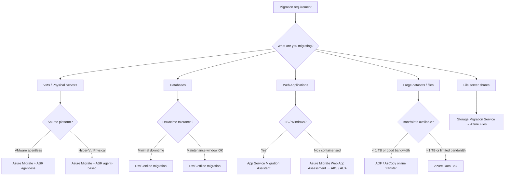

# Migration

## Azure Migration Services Overview

Azure provides a family of purpose-built migration services. Each targets a specific
source type (servers, databases, data, applications) and a specific migration pattern
(lift-and-shift, re-platform, offline bulk transfer, online replication).

| Service | Abbreviation | Source Type | Pattern | Key Capability |
| --- | --- | --- | --- | --- |
| **Azure Migrate** | AM | Servers, VMs, databases, web apps | Assess + lift-and-shift | Central hub; discovery, assessment, and replication agents |
| **Azure Database Migration Service** | DMS | SQL Server, MySQL, PostgreSQL, MongoDB, Oracle | Online + offline DB migration | Minimal-downtime cutover; schema/data conversion |
| **Azure Data Box** | — | Large offline datasets (TBs–PBs) | Offline bulk transfer | Physical appliance shipped to Azure datacenter |
| **Azure Site Recovery** | ASR | Azure VMs, VMware, Hyper-V, physical | Continuous replication / DR | Also used as live migration engine for lift-and-shift |
| **Azure Arc** | — | On-prem, multi-cloud servers and Kubernetes | Hybrid management + migration staging | Projects non-Azure resources into ARM for consistent governance |
| **App Service Migration Assistant** | ASMA | IIS web apps (.NET, PHP) | Re-platform to App Service | Readiness assessment; automated migration of IIS sites |
| **Azure Data Factory** | ADF | Any data store (files, databases, SaaS) | ETL / data pipeline migration | Managed pipelines; 90+ connectors; used during data estate migration |
| **Storage Migration Service** | SMS | Windows file servers, NAS (SMB) | File share migration to Azure Files or Storage | Inventory, transfer, and cutover of file shares |

> **Exam tip:** Azure Migrate is the starting point for most migration scenarios — it
> provides a unified hub for discovery, dependency mapping, cost assessment, and
> replication. You do NOT perform the actual migration directly from Azure Migrate;
> it orchestrates other tools (ASR for VMs, DMS for databases, App Service Migration
> Assistant for web apps).

## Azure Migrate in Detail

Azure Migrate is the central orchestration hub. It does not migrate workloads itself —
it coordinates the correct specialist tool based on workload type.

### Azure Migrate Components

| Component | Role |
| --- | --- |
| **Azure Migrate: Discovery and Assessment** | Discovers on-prem VMs (VMware vSphere, Hyper-V, physical) and assesses readiness, right-sizing, and Azure cost estimates |
| **Azure Migrate: Server Migration** | Replicates and migrates VMs to Azure (uses ASR agent-based or agentless replication under the hood) |
| **Azure Migrate: Database Assessment** | Assesses SQL Server instances for migration readiness and targets (Azure SQL DB, SQL MI, SQL Server on VM) |
| **Azure Migrate: Web App Assessment** | Detects IIS web apps and delegates to App Service Migration Assistant |
| **Movere (acquired)** | SaaS discovery tool integrated with Azure Migrate for large-scale estate scanning and cloud economics reporting |

### Migration Phases

| Phase | Activity | Tools Used |
| --- | --- | --- |
| **Discover** | Inventory all on-prem assets | Azure Migrate appliance, Movere, Service Map |
| **Assess** | Readiness, right-sizing, cost estimate | Azure Migrate Assessment, Azure TCO Calculator |
| **Migrate** | Replicate and cut over | ASR (VMs), DMS (databases), ASMA (web apps), ADF (data) |
| **Optimise** | Right-size, reserve instances, apply governance | Azure Advisor, Cost Management, Azure Policy |
| **Secure & Manage** | Governance, monitoring, backup | Azure Policy, Azure Monitor, Azure Backup, Microsoft Defender for Cloud |

> **Exam tip:** The five migration phases — Discover, Assess, Migrate, Optimise, Secure &
> Manage — are the Cloud Adoption Framework (CAF) migrate guidance stages. Expect
> scenario questions that map a problem (e.g. "unknown on-prem inventory") to a phase
> (Discover) and a tool (Azure Migrate appliance or Movere).

## Azure Database Migration Service (DMS)

DMS supports two migration modes:

| Mode | Downtime | Use Case |
| --- | --- | --- |
| **Offline** | Downtime required (one-time bulk load) | Small databases, maintenance window available |
| **Online** | Minimal downtime (continuous sync then cutover) | Production databases, tight SLA, near-zero downtime cutover |

### DMS Source-to-Target Matrix

| Source | Target Options |
| --- | --- |
| SQL Server (on-prem / IaaS) | Azure SQL Database, Azure SQL Managed Instance, SQL Server on Azure VM |
| MySQL (on-prem / RDS) | Azure Database for MySQL — Flexible Server |
| PostgreSQL (on-prem / RDS) | Azure Database for PostgreSQL — Flexible Server |
| MongoDB | Azure Cosmos DB for MongoDB |
| Oracle | Azure Database for PostgreSQL (via ora2pg) |

> **Exam tip:** Online migration to Azure SQL Managed Instance requires DMS Premium
> tier and a managed instance with a VNet-injected DMS subnet. Offline migration is
> simpler but requires a maintenance window. DMS does NOT migrate application
> connection strings — that is a separate application change task.

## Azure Data Box

Azure Data Box is used when the dataset is too large to transfer over the internet
within an acceptable time window (typically > 1 TB or constrained bandwidth).

### Data Box Product Family

| Product | Capacity | Use Case |
| --- | --- | --- |
| **Data Box Disk** | Up to 8 TB per disk (max 5 disks = 40 TB) | Small to medium datasets; low-touch shipping |
| **Data Box** | 80 TB usable | Standard bulk transfer; single appliance |
| **Data Box Heavy** | 770 TB usable | Petabyte-scale; large data centres and archives |
| **Data Box Gateway** (virtual) | Unlimited (cloud-backed) | Continuous ingestion from on-prem without physical device |
| **Azure Stack Edge** | Variable | Edge compute + data transfer; local ML inference before shipping |

> **Exam tip:** When a scenario mentions "limited bandwidth", "offline data transfer",
> or a dataset in the hundreds of TB to PB range, Data Box is the answer. For ongoing
> continuous transfer with compute at the edge, choose Data Box Gateway or Azure Stack
> Edge. Data Box is a one-time bulk transfer — not a replication solution.

## Azure Site Recovery as a Migration Tool

ASR is covered in detail in the High Availability & DR section. In a migration context
it is used as the live replication engine for VM lift-and-shift, coordinated through
Azure Migrate: Server Migration.

Key migration-specific behaviours:

- Agentless replication (VMware only) — uses the Azure Migrate appliance; no agent
  installed on source VMs.
- Agent-based replication — Mobility Service agent installed on each source VM;
  supports VMware, Hyper-V, and physical servers.
- Test migration — validates the migrated VM in an isolated VNet without impacting
  the source production workload.
- Cutover — stops replication, deallocates the source VM, and promotes the Azure VM.

> **Exam tip:** Agentless migration via Azure Migrate is VMware-only. Physical servers
> and Hyper-V always require the Mobility Service agent. Test migration before final
> cutover is a best-practice step that appears frequently in scenario questions.

## App Service Migration Assistant

The App Service Migration Assistant (ASMA) targets IIS-hosted web applications (.NET,
PHP) running on Windows Server.

| Step | What Happens |
| --- | --- |
| **Pre-migration assessment** | Scans IIS sites for compatibility (bindings, authentication, certificates, dependencies) |
| **Readiness report** | Lists blockers (e.g. unsupported auth modes) and warnings (e.g. non-standard port) |
| **Automated migration** | Creates App Service Plan, App Service app, migrates IIS site content and config |
| **Hybrid Connection** | Configures Azure Relay Hybrid Connection if the app needs to reach on-prem resources post-migration |

> **Exam tip:** ASMA cannot migrate applications that use Windows Authentication with
> Kerberos delegation, COM+ components, or MSMQ. These require remediation before
> migration or a different target (VM instead of App Service).

## Storage Migration Service (SMS)

SMS migrates Windows file server and NAS shares to Azure Files or Azure Blob Storage.
It runs as a Windows feature on Windows Server 2016 and later.

| Step | Activity |
| --- | --- |
| **Inventory** | Enumerates all shares, files, permissions (ACLs), and ownership on the source |
| **Transfer** | Copies data to the destination share while the source is still live |
| **Cutover** | Redirects clients by transferring the source server's identity (name and IP) to the destination |

> **Exam tip:** SMS transfers NTFS ACLs and share permissions — this is a key
> differentiator from a manual robocopy approach. Cutover transfers the server identity
> so clients reconnect without reconfiguration.

## Azure Arc for Migration Staging

Azure Arc projects on-premises servers and Kubernetes clusters into Azure Resource
Manager. In a migration context it is used during the pre-migration phase to:

- Apply Azure Policy to on-prem servers before migration (enforce consistency)
- Enrol servers in Microsoft Defender for Cloud for pre-migration security posture
- Tag and organise on-prem resources using the same ARM resource hierarchy as
  the target Azure environment
- Install the Azure Monitor agent on on-prem VMs to baseline performance before
  right-sizing assessments

> **Exam tip:** Azure Arc does not move workloads — it extends Azure management plane
> control to non-Azure resources. It is a pre-migration governance and observability
> tool, not a migration execution tool.

## Migration Decision Flow

> **Exam tip:** Start with Azure Migrate as the hub regardless of workload type. The
> hub routes you to the correct specialist tool: ASR for VMs, DMS for databases, ASMA
> for IIS web apps, Data Box for large offline datasets, SMS for file shares.
> For hybrid management during staging, add Azure Arc.
